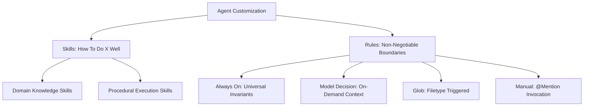
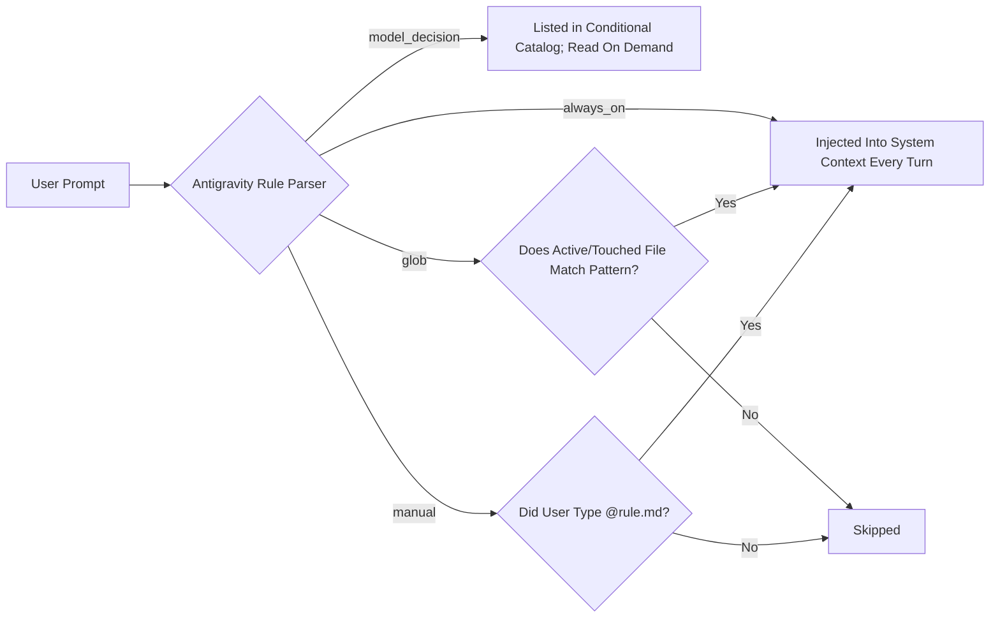

# 🤖 AI Agent Toolkit (`ai-agent-toolkit`)

[](https://github.com/muralitharan805/ai-agent-toolkit/actions/workflows/ci.yml)

[](https://agentskills.io)
[](https://deepmind.google)
[](https://pnpm.io)
[](LICENSE)

An open-source source-of-truth for **Agent Skills** (adhering to the [`agentskills.io`](https://agentskills.io) open standard), reusable engineering context, and agent-specific rules. It is designed to author once, validate locally, and synchronize selected skills into supported coding-agent environments.

Instead of hand-crafting agent instructions and context repeatedly inside every repo—only for them to drift, become outdated, or get lost across teams—**`ai-agent-toolkit`** allows developers and teams to scaffold, generate, validate, and synchronize battle-tested agent context directly into any project workspace (`.agents/`) or user global environment (`~/.gemini/`).

---

## 📑 Table of Contents

1. [Why This Toolkit Exists](#-why-this-toolkit-exists)
2. [Core Concepts: Skills vs. Rules](#-core-concepts-skills-vs-rules)
3. [The 5-Pillar Modular Agent Skill Architecture](#-the-5-pillar-modular-agent-skill-architecture)
4. [Antigravity Rules & Activation Trigger Strategies](#-antigravity-rules--activation-trigger-strategies)
5. [Repository Directory Layout](#-repository-directory-layout)
6. [Built-in AI Generators & Developer Tooling](#-built-in-ai-generators--developer-tooling)
7. [Flagship Agent: Problem Discovery Orchestrator](#-flagship-agent-problem-discovery-orchestrator)
8. [Tool-Aware Context CLI (`context.sh`)](#-tool-aware-context-cli-contextsh)
9. [Quickstart Guide for New Users](#-quickstart-guide-for-new-users)
10. [How to Contribute to the Open-Source Toolkit](#-how-to-contribute-to-the-open-source-toolkit)

---

## 🎯 Why This Toolkit Exists

Every engineering team adopting AI coding assistants faces the same operational bottlenecks:
- **Context Drift**: Prompts and conventions written in one repo rarely propagate to new repositories.
- **Token Inefficiency**: Dumping massive instruction sets into system prompts wastes LLM context windows and degrades instruction adherence.
- **Unverified Quality**: Without explicit eval cases and deterministic checks, it is difficult to know whether agent instructions improve outcomes or merely look convincing.
- **No Standard Format**: Instructions are fragmented across ad-hoc markdown files, legacy workflows, and unversioned IDE settings.

**`ai-agent-toolkit`** solves this by establishing a single source of truth grounded in the official [`agentskills.io`](https://agentskills.io) open standard.

---

## 🧠 Core Concepts: Skills vs. Rules

In modern agentic coding (specifically Google Antigravity IDE), agent customization is divided into two distinct, complementary primitives:



| Dimension | **Agent Skills** (`skills/`) | **Agent Rules** (`rules/`) |
| :--- | :--- | :--- |
| **Primary Purpose** | **Procedural & Domain Expertise** — Teaches the agent *how* to build features, deploy code, and leverage framework idioms. | **Hard Invariants & Constraints** — Enforces non-negotiable boundaries, prohibited anti-patterns, and project styles. |
| **Architecture** | **5-Pillar Modular Directory Bundle** (`SKILL.md`, `references/`, `scripts/`, `assets/`, `evals/`). | **Single Markdown File** (`<rule-name>.md`) with YAML frontmatter (< 12,000 characters). |
| **Standard** | [`agentskills.io`](https://agentskills.io) Open Standard. | Google Antigravity IDE Native Specification. |
| **Discovery Model** | Progressive disclosure (Tier 1 name/description $\rightarrow$ Tier 2 instructions $\rightarrow$ Tier 3 deep assets). | Context-injected based on Trigger (`always_on`, `model_decision`, `glob`, `manual`). |
| **Examples** | `angular-enterprise-forms`, `dockerfile-builder`, `eval-skill`. | `clean-code-standards.md`, `pnpm-mandatory-package-manager.md`. |

> [!NOTE]
> **Workflows Sunset Notice**: Google Antigravity IDE has officially deprecated standalone workflows (`.agents/workflows/*.md`), with full retirement on November 1, 2026. All multi-step sequential processes (deployments, scaffolding pipelines) in this toolkit are authored as **Procedural Skills** with executable scripts and progress checklists.

---

## 🏛️ The 5-Pillar Modular Agent Skill Architecture

Every production-grade Skill in this repository follows the **5-Pillar Modular Bundle Architecture** aligned with the [`agentskills.io`](https://agentskills.io) open specification.

```text
[skill-name]/
├── SKILL.md                          # Pillar 1: Core Instruction & Progressive Disclosure (< 500 lines)
├── references/                       # Pillar 2: Authoritative References & Deep Domain Guides
│   ├── api-specification.md
│   └── domain-patterns.md
├── scripts/                          # Pillar 3: Agentic Execution Scripts & Automation Tools
│   └── tool_runner.py                # Executable CLI tool (PEP 723, JSON stdout, diagnostic stderr)
├── assets/                           # Pillar 4: Output Templates, Schemas & Starter Boilerplates
│   ├── template.json
│   └── output-schema.json
└── evals/                            # Pillar 5: Empirical Verification Suites & Grading Scorecards
    ├── evals.json                    # Binary objective assertions & benchmark test cases
    └── grading.json                  # Automated scorecard & net skill lift tracking
```

### Deep Dive into the 5 Pillars

#### 1. Pillar 1: Core Instruction (`SKILL.md`)
The entry point for the agent. It enforces a **3-Tier Progressive Disclosure** model:
- **Tier 1 (Frontmatter)**: `name` (kebab-case matching the folder) and `description` (1–1024 characters written in imperative third-person). This is all the agent sees during initial conversation indexing.
- **Tier 2 (Body)**: Strictly under 500 lines. Focuses on personas, actionable execution phases, relative links to Pillar 2 references, and a mandatory `## Gotchas` section capturing non-obvious traps and failure points.

#### 2. Pillar 2: Authoritative References (`references/`)
Tier 3 deep-dive documentation loaded into the agent's context **only when specifically needed**:
- Deep architectural specifications and edge runtime restrictions (e.g. Cloudflare V8 worker limitations).
- Migration runbooks and comprehensive API guides.
- Keeps `SKILL.md` lean and token-efficient.

#### 3. Pillar 3: Agentic Execution Scripts (`scripts/`)
Executable tools that agents can run autonomously in the environment:
- **Agentic Standard**: Emits structured machine-readable JSON to `stdout`, logs human diagnostics to `stderr`, and supports `--help`.
- **Portability**: Python scripts use inline PEP 723 dependency metadata (`# /// script ... ///`). Prefer `uv run <script.py>` so declared dependencies are resolved automatically; plain `python3` works only when required dependencies are already installed.
- **Black-Box Principle**: Agents execute scripts with flags rather than reading hundreds of lines of implementation code into context.

#### 4. Pillar 4: Assets & Starter Templates (`assets/`)
Production-grade blueprints, schema definitions, and scaffolding templates:
- JSON Schemas (Draft 2020-12) for validating structured outputs.
- Starter template files (HTML, SCSS, JSON, TS) so the agent never starts from a blank page.

#### 5. Pillar 5: Evaluation Definitions (`evals/`)
Defines realistic prompts and assertions that can be used by deterministic graders today and by a full agent-eval harness later:
- `evals/evals.json`: Real-world user prompts paired with objective assertions and optional expected files.
- `evals/grading.json`: Generated by `eval-skill` or `run_evals.py`. The current local runner reports only assertions it can deterministically verify; semantic assertions remain `not_evaluated` instead of being auto-passed.
- Comparative baseline-vs-equipped skill lift is **not** reported until a real agent execution harness performs both runs.


---

## ⚡ Antigravity Rules & Activation Trigger Strategies

Antigravity Rules live as Markdown files inside `.agents/rules/` (Workspace) or `~/.gemini/GEMINI.md` (Global). Every rule must declare its activation trigger in its YAML frontmatter:

```yaml
---
description: "Enforces strict enterprise standards for Angular Reactive Forms with zero any types."
trigger: model_decision
---
```

### The 4 Trigger Strategies Explained



| Trigger | YAML Frontmatter | Token Impact | Recommended Use Case |
| :--- | :--- | :--- | :--- |
| **`always_on`** | `trigger: always_on` | **Heavy** (Loads full file on every turn) | Universal workspace invariants only (e.g. Clean Code Standards, Package Manager enforcement). |
| **`model_decision`** | `trigger: model_decision`<br>`description: "..."` | **Optimal** (~30 tokens for catalog entry; loads file only when relevant) | **Recommended Default** for specialized domain knowledge, prompt generation, database schemas, and architectural patterns. |
| **`glob`** | `trigger: glob`<br>`globs: ["**/*.scss", "src/**"]` | **Targeted** (Loads only when matching files are active) | Language-specific syntax rules, styling guidelines, or test file constraints. |
| **`manual`** | `trigger: manual` | **Zero Baseline** (Loads only on explicit mention) | Rare, high-friction operational workflows (e.g. major migration or database wipe runbooks). |

> [!TIP]
> **Token Budget Best Practice**: Never default to `always_on` for specialized rules. Using `model_decision` or `glob` keeps your active context window lightweight and prevents token bloat!

---

## 📂 Repository Directory Layout

The repository separates **consumer context** from **toolkit authoring tools**:

```text
ai-agent-toolkit/
├── frameworks/             # Framework-specific consumer context
├── infra/                  # Infrastructure and platform consumer context
├── domains/                # Domain-specific consumer context
├── shared/                 # Cross-cutting consumer context
│
├── tools/generators/                # Toolkit authoring/evaluation tools (opt-in)
│   ├── generate-skill/
│   ├── generate-rule/
│   ├── generate-prompt/
│   ├── generate-agent-suite/
│   ├── eval-skill/
│   ├── audit-agent-toolkit/
│   ├── consolidate-agent-toolkit/
│   └── expert-authoring-quality/
│
├── bin/
│   ├── context.sh          # Primary tool-aware sync/cleanup CLI
│   └── toolkit_manifest.py # Ownership manifest + safe cleanup helper
│
├── tests/
├── source-doc/
└── .github/workflows/
```

`frameworks/`, `infra/`, `domains/`, and `shared/` are the consumer catalog. `tools/generators/` is intentionally excluded from default workspace sync and `--all`. Select a `tools/generators/...` path explicitly only when developing the toolkit itself.

---

## 🛠️ Built-in AI Generators & Developer Tooling

Authoring utilities live under `tools/generators/<tool>/skills/`.

```bash
# Validate an individual skill
uv run tools/generators/generate-skill/skills/scripts/validate_skill.py \
  frameworks/angular/angular-enterprise-forms/skills

# Run deterministic eval checks
uv run tools/generators/eval-skill/skills/scripts/run_evals.py \
  frameworks/angular/angular-enterprise-forms/skills --save-grading

# Explicitly sync an authoring tool into a toolkit-development workspace
./bin/context.sh -w tools/generators/generate-skill --target /path/to/toolkit-development-workspace
```

The authoring tools are not part of normal consumer sync.

---

## 🔍 Flagship Agent: Problem Discovery Orchestrator

The toolkit includes an autonomous Python-based orchestrator agent (`agents.problem_discovery`) powered by the official Google Antigravity SDK. It guides product discovery from raw domain prompts to evidence collection, 35-point evaluation, preregistered experiment contracts, and an automated **SeyaliCraft Build Verdict (Go / No-Go)**.

For complete architectural details and advanced runbooks, see the dedicated [Problem Discovery Agent Documentation](agents/problem_discovery/README.md).

### Quick CLI Execution Cheat Sheet

```bash
# 1. Run full-pipeline research from a prompt file until a real gate
python -m agents.problem_discovery.cli --file geo_research.txt --db-path discovery.sqlite --until-blocked

# 2. View SeyaliCraft Build Verdict (Build vs Don't Build) for all candidates
python -m agents.problem_discovery.cli --db-path discovery.sqlite --verdict

# 3. View Build Verdict for a specific candidate
python -m agents.problem_discovery.cli --db-path discovery.sqlite --verdict CAND-001

# 4. Zero-token read-only status query (instant SQLite FTS search)
python -m agents.problem_discovery.cli --db-path discovery.sqlite "CAND-001 status enna?"

# 5. Resume a paused run or candidate
python -m agents.problem_discovery.cli --db-path discovery.sqlite "Continue RUN-2026-001" --until-blocked

# 6. Launch an interactive terminal session
python -m agents.problem_discovery.cli --db-path discovery.sqlite --interactive
```

---

## 🔄 Tool-Aware Context CLI (`context.sh`)

`bin/context.sh` is the primary context lifecycle command. It resolves selected toolkit directories, routes supported context types to the selected AI tool, records ownership, and can safely clean up what it installed.

```bash
./bin/context.sh -w [selectors...] [--tool antigravity|codex|claude] [--target <project>]
./bin/context.sh -g [selectors...] --tool antigravity
```

Antigravity is the default tool.

### Workspace Routing

| Tool | Workspace destination | Supported context |
| :--- | :--- | :--- |
| `antigravity` | `<project>/.agents/` | Skills, rules, workflows, plugins |
| `codex` | `<project>/.agents/skills/` | Skills |
| `claude` | `<project>/.claude/skills/` | Skills |

Unsupported context types are reported and skipped instead of being copied into an incorrect directory.

```bash
# Antigravity is the default
./bin/context.sh -w frameworks/angular --target ~/projects/app

# Codex workspace skills
./bin/context.sh -w angular/angular-enterprise-forms \
  --tool codex \
  --target ~/projects/app

# Claude workspace skills
./bin/context.sh -w angular/angular-enterprise-forms \
  --tool claude \
  --target ~/projects/app
```

### Global Routing

Global context currently supports **Antigravity only**. Codex and Claude are intentionally workspace-only in this toolkit.

```bash
./bin/context.sh -g shared/security-baseline --tool antigravity
```

Antigravity global context uses the configured Gemini/Antigravity directories. Selected rules are combined inside the toolkit-owned block in `~/.gemini/GEMINI.md`:

```text
<!-- AGENT_TOOLKIT_START -->
...toolkit-managed combined rules...
<!-- AGENT_TOOLKIT_END -->
```

Content outside those markers remains user-owned and is preserved.

### Directory, Parent, Nested, and Glob Selectors

Selectors may point to a whole parent, a nested child, or a glob. Quote globs so your shell does not expand them before `context.sh` receives them.

```bash
# Parent: recursively discover all Angular context modules
./bin/context.sh -w frameworks/angular --target ~/projects/app

# Shorthand nested path (resolved under catalog roots)
./bin/context.sh -w angular/angular-enterprise-forms --target ~/projects/app

# Glob children
./bin/context.sh -w 'angular/*' --target ~/projects/app

# Multiple areas
./bin/context.sh -w infra/docker infra/postgres shared/security-baseline \
  --target ~/projects/api
```

`--all` syncs only the consumer catalog roots: `frameworks/`, `infra/`, `domains/`, and `shared/`. It never includes the internal `tools/` root.

### Safe Ownership and `MANIFEST_HELPER`

`bin/context.sh` is the installer/router. `bin/toolkit_manifest.py` is the ownership ledger used before and after filesystem changes.

For an Antigravity or Codex workspace the manifest is stored under `<project>/.agents/.toolkit-manifest.json`; for a Claude workspace it is stored under `<project>/.claude/.toolkit-manifest.json`.

Each managed entry records the source, exact target, context kind, scope, tool, and installed hash:

```json
{
  "version": 2,
  "managed": {
    "skills/angular-enterprise-forms": {
      "source": "frameworks/angular/angular-enterprise-forms/skills",
      "target": "skills/angular-enterprise-forms",
      "kind": "skill",
      "scope": "workspace",
      "tool": "antigravity",
      "hash": "..."
    }
  }
}
```

This provides the safety boundary:

- Existing content not present in the manifest is treated as user-owned and is not overwritten by default.
- Toolkit-managed content with local modifications is preserved by default.
- `--force` explicitly allows replacement during sync.
- Cleanup considers only manifest-owned paths.
- Codex workspace cleanup is skill-scoped, so Antigravity rules sharing the same `.agents` root are preserved.
- Antigravity global rule sources are tracked as a manifest aggregate so selective cleanup can rebuild the combined toolkit block correctly.
- `GEMINI.md` is not treated as a toolkit-owned file; only the tagged toolkit block is managed.

### Cleanup

Remove everything the toolkit owns in one workspace:

```bash
./bin/context.sh -w --target ~/projects/app --clean
```

Remove only context that originated under a selector:

```bash
./bin/context.sh -w frameworks/angular --target ~/projects/app --clean
```

If a toolkit-managed target was edited locally, normal cleanup preserves it. To explicitly discard those local changes too:

```bash
./bin/context.sh -w --target ~/projects/app --force-clean
```

For Antigravity global cleanup:

```bash
./bin/context.sh -g --tool antigravity --clean
```

This removes manifest-owned global context and only the toolkit marker block from `GEMINI.md`; unrelated user content remains.

---

## 🚀 Quickstart Guide for New Users

### 1. Clone Once

```bash
git clone https://github.com/muralitharan805/ai-agent-toolkit.git
cd ai-agent-toolkit
```

### 2. Sync Context into a Project

```bash
# Antigravity
./bin/context.sh -w 'angular/*' --target ~/projects/my-angular-app

# Codex
./bin/context.sh -w frameworks/angular --tool codex --target ~/projects/my-angular-app
```

### 3. Optional Antigravity Global Defaults

```bash
./bin/context.sh -g --tool antigravity
```

The toolkit repository remains the source of truth; the manifest tracks only what the toolkit installs into each destination.

---

## 🤝 How to Contribute to the Open-Source Toolkit

We welcome contributions from open-source developers! Follow these steps to contribute a new Skill or Rule:

### Adding a New Skill
1. **Deduplication Check**: Inspect `frameworks/`, `infra/`, or `shared/` to ensure a similar skill does not already exist. If it does, enhance the existing bundle.
2. **Scaffold the Bundle**:
   - Create your directory under `[category]/[topic]/skills/[skill-name]/`.
   - Scaffold the 5 pillars: `SKILL.md`, `references/`, `scripts/`, `assets/`, and `evals/evals.json`.
3. **Automated Validation**:
   ```bash
   uv run tools/generators/generate-skill/skills/scripts/validate_skill.py [path-to-skill]
   ```
   Ensure it reports **100% PASS** with 0 errors and 0 warnings.
4. **Empirical Evaluation**:
   ```bash
   uv run tools/generators/eval-skill/skills/scripts/run_evals.py [path-to-skill] --save-grading
   ```

### Adding a New Rule
1. Create `[category]/[topic]/rules/[rule-name].md`.
2. Target 6,000–8,000 characters (hard ceiling of 12,000 characters).
3. Specify an efficient trigger: `model_decision` (for on-demand guidance) or `glob` with `globs: [...]`. Reserve `always_on` strictly for universal invariants.
4. Validate with:
   ```bash
   uv run tools/generators/generate-rule/skills/scripts/validate_rule.py [path-to-rule.md]
   ```

### Submission
Submit a Pull Request adhering to Conventional Commits:
```bash
git checkout -b feat/add-kubernetes-operator-skill
git commit -m "feat(infra): add kubernetes operator 5-pillar skill"
```

---

## 📄 License

This project is licensed under the [MIT License](LICENSE).
Built with ❤️ for the global AI Agent and Open Source developer community.
