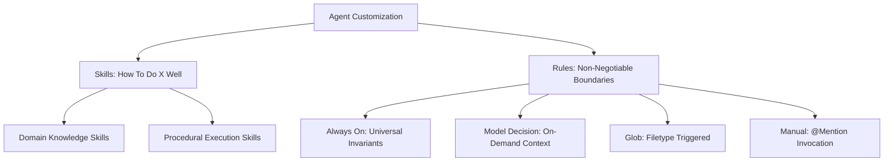
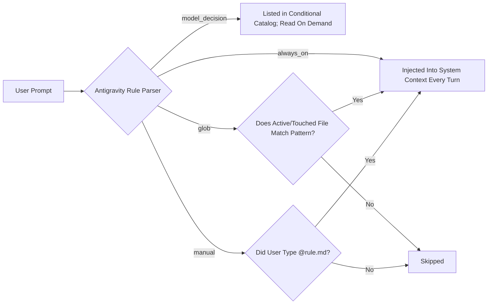
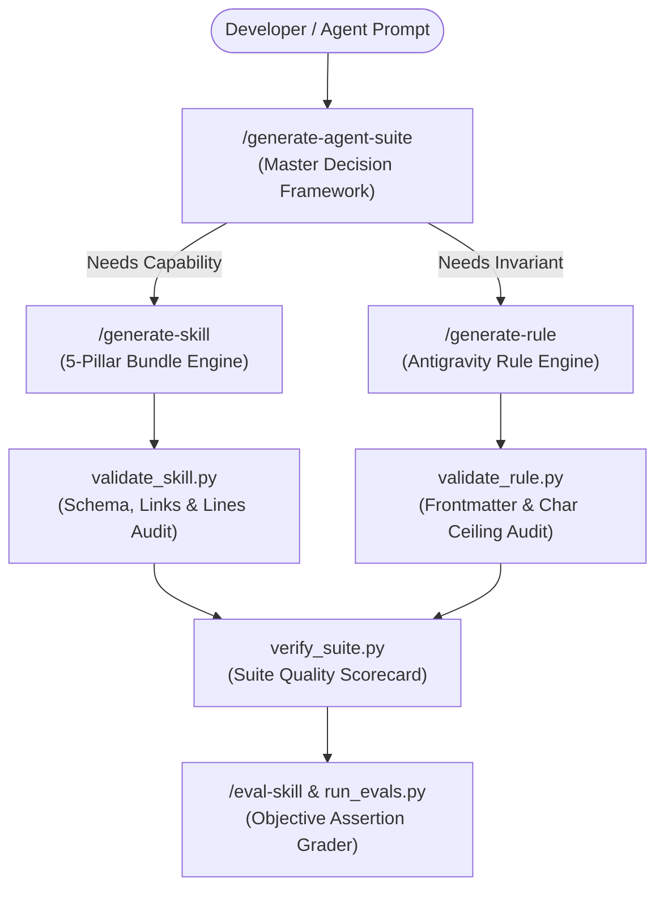

# 🤖 AI Agent Toolkit (`ai-agent-toolkit`)

[](https://agentskills.io)
[](https://deepmind.google)
[](https://pnpm.io)
[](LICENSE)

An enterprise-grade, open-source centralized repository of **Agent Skills** (adhering to the [`agentskills.io`](https://agentskills.io) open standard) and **Antigravity Rules** for AI coding agents.

Instead of hand-crafting agent instructions and context repeatedly inside every repo—only for them to drift, become outdated, or get lost across teams—**`ai-agent-toolkit`** allows developers and teams to scaffold, generate, validate, and synchronize battle-tested agent context directly into any project workspace (`.agents/`) or user global environment (`~/.gemini/`).

---

## 📑 Table of Contents

1. [Why This Toolkit Exists](#-why-this-toolkit-exists)
2. [Core Concepts: Skills vs. Rules](#-core-concepts-skills-vs-rules)
3. [The 5-Pillar Modular Agent Skill Architecture](#-the-5-pillar-modular-agent-skill-architecture)
4. [Antigravity Rules & Activation Trigger Strategies](#-antigravity-rules--activation-trigger-strategies)
5. [Repository Directory Layout](#-repository-directory-layout)
6. [Built-in AI Generators & Developer Tooling](#-built-in-ai-generators--developer-tooling)
7. [Universal Dynamic Sync Engine (`sync-context.sh`)](#-universal-dynamic-sync-engine-sync-contextsh)
8. [Quickstart Guide for New Users](#-quickstart-guide-for-new-users)
9. [How to Contribute to the Open-Source Toolkit](#-how-to-contribute-to-the-open-source-toolkit)

---

## 🎯 Why This Toolkit Exists

Every engineering team adopting AI coding assistants faces the same operational bottlenecks:
- **Context Drift**: Prompts and conventions written in one repo rarely propagate to new repositories.
- **Token Inefficiency**: Dumping massive instruction sets into system prompts wastes LLM context windows and degrades instruction adherence.
- **Subjective Quality**: Without verifiable evaluation criteria, it is impossible to know whether agent instructions actually improve code quality or silently fail.
- **No Standard Format**: Instructions are fragmented across ad-hoc markdown files, legacy workflows, and unversioned IDE settings.

**`ai-agent-toolkit`** solves this by establishing a single source of truth grounded in the official [`agentskills.io`](https://agentskills.io) open standard.

---

## 🧠 Core Concepts: Skills vs. Rules

In modern agentic coding (specifically Google Antigravity IDE), agent customization is divided into two distinct, complementary primitives:



| Dimension | **Agent Skills** (`skills/`) | **Agent Rules** (`rules/`) |
| :--- | :--- | :--- |
| **Primary Purpose** | **Procedural & Domain Expertise** — Teaches the agent *how* to build features, deploy code, and leverage framework idioms. | **Hard Invariants & Constraints** — Enforces non-negotiable boundaries, prohibited anti-patterns, and project styles. |
| **Architecture** | **5-Pillar Modular Directory Bundle** (`SKILL.md`, `references/`, `scripts/`, `assets/`, `evals/`). | **Single Markdown File** (`<rule-name>.md`) with YAML frontmatter (< 12,000 characters). |
| **Standard** | [`agentskills.io`](https://agentskills.io) Open Standard. | Google Antigravity IDE Native Specification. |
| **Discovery Model** | Progressive disclosure (Tier 1 name/description $\rightarrow$ Tier 2 instructions $\rightarrow$ Tier 3 deep assets). | Context-injected based on Trigger (`always_on`, `model_decision`, `glob`, `manual`). |
| **Examples** | `angular-enterprise-forms`, `dockerfile-builder`, `eval-skill`. | `clean-code-standards.md`, `pnpm-mandatory-package-manager.md`. |

> [!NOTE]
> **Workflows Sunset Notice**: Google Antigravity IDE has officially deprecated standalone workflows (`.agents/workflows/*.md`), with full retirement on November 1, 2026. All multi-step sequential processes (deployments, scaffolding pipelines) in this toolkit are authored as **Procedural Skills** with executable scripts and progress checklists.

---

## 🏛️ The 5-Pillar Modular Agent Skill Architecture

Every production-grade Skill in this repository follows the **5-Pillar Modular Bundle Architecture** aligned with the [`agentskills.io`](https://agentskills.io) open specification.

```text
[skill-name]/
├── SKILL.md                          # Pillar 1: Core Instruction & Progressive Disclosure (< 500 lines)
├── references/                       # Pillar 2: Authoritative References & Deep Domain Guides
│   ├── api-specification.md
│   └── domain-patterns.md
├── scripts/                          # Pillar 3: Agentic Execution Scripts & Automation Tools
│   └── tool_runner.py                # Executable CLI tool (PEP 723, JSON stdout, diagnostic stderr)
├── assets/                           # Pillar 4: Output Templates, Schemas & Starter Boilerplates
│   ├── template.json
│   └── output-schema.json
└── evals/                            # Pillar 5: Empirical Verification Suites & Grading Scorecards
    ├── evals.json                    # Binary objective assertions & benchmark test cases
    └── grading.json                  # Automated scorecard & net skill lift tracking
```

### Deep Dive into the 5 Pillars

#### 1. Pillar 1: Core Instruction (`SKILL.md`)
The entry point for the agent. It enforces a **3-Tier Progressive Disclosure** model:
- **Tier 1 (Frontmatter)**: `name` (kebab-case matching the folder) and `description` (1–1024 characters written in imperative third-person). This is all the agent sees during initial conversation indexing.
- **Tier 2 (Body)**: Strictly under 500 lines. Focuses on personas, actionable execution phases, relative links to Pillar 2 references, and a mandatory `## Gotchas` section capturing non-obvious traps and failure points.

#### 2. Pillar 2: Authoritative References (`references/`)
Tier 3 deep-dive documentation loaded into the agent's context **only when specifically needed**:
- Deep architectural specifications and edge runtime restrictions (e.g. Cloudflare V8 worker limitations).
- Migration runbooks and comprehensive API guides.
- Keeps `SKILL.md` lean and token-efficient.

#### 3. Pillar 3: Agentic Execution Scripts (`scripts/`)
Executable tools that agents can run autonomously in the environment:
- **Agentic Standard**: Emits structured machine-readable JSON to `stdout`, logs human diagnostics to `stderr`, and supports `--help`.
- **Portability**: Python scripts use inline PEP 723 dependency metadata (`# /// script ... ///`) so they run seamlessly via standard `python3` or `uv`.
- **Black-Box Principle**: Agents execute scripts with flags rather than reading hundreds of lines of implementation code into context.

#### 4. Pillar 4: Assets & Starter Templates (`assets/`)
Production-grade blueprints, schema definitions, and scaffolding templates:
- JSON Schemas (Draft 2020-12) for validating structured outputs.
- Starter template files (HTML, SCSS, JSON, TS) so the agent never starts from a blank page.

#### 5. Pillar 5: Empirical Verification & Evals (`evals/`)
Proves empirically that the skill actually improves AI coding performance:
- `evals/evals.json`: Real-world user prompts paired with **Objective, Binary Assertions** (Structural checks, Negative anti-pattern prohibitions, API correctness). Subjective assessments ("code looks clean") are strictly forbidden.
- `evals/grading.json`: Generated by `eval-skill` or `run_evals.py`. Records pass rates, evidence citations, and computes the **Net Skill Lift** ($\Delta = \text{Equipped Rate} - \text{Baseline Rate}$).

---

## ⚡ Antigravity Rules & Activation Trigger Strategies

Antigravity Rules live as Markdown files inside `.agents/rules/` (Workspace) or `~/.gemini/GEMINI.md` (Global). Every rule must declare its activation trigger in its YAML frontmatter:

```yaml
---
description: "Enforces strict enterprise standards for Angular Reactive Forms with zero any types."
trigger: model_decision
---
```

### The 4 Trigger Strategies Explained



| Trigger | YAML Frontmatter | Token Impact | Recommended Use Case |
| :--- | :--- | :--- | :--- |
| **`always_on`** | `trigger: always_on` | **Heavy** (Loads full file on every turn) | Universal workspace invariants only (e.g. Clean Code Standards, Package Manager enforcement). |
| **`model_decision`** | `trigger: model_decision`<br>`description: "..."` | **Optimal** (~30 tokens for catalog entry; loads file only when relevant) | **Recommended Default** for specialized domain knowledge, prompt generation, database schemas, and architectural patterns. |
| **`glob`** | `trigger: glob`<br>`globs: ["**/*.scss", "src/**"]` | **Targeted** (Loads only when matching files are active) | Language-specific syntax rules, styling guidelines, or test file constraints. |
| **`manual`** | `trigger: manual` | **Zero Baseline** (Loads only on explicit mention) | Rare, high-friction operational workflows (e.g. major migration or database wipe runbooks). |

> [!TIP]
> **Token Budget Best Practice**: Never default to `always_on` for specialized rules. Using `model_decision` or `glob` keeps your active context window lightweight and prevents token bloat!

---

## 📂 Repository Directory Layout

The toolkit is organized cleanly into 3 primary public directories and an automated synchronization utility:

```text
ai-agent-toolkit/
├── frameworks/             # Language & Framework-Specific Context
│   ├── angular/            # Modern Angular 19+ (Signals, Zoneless, M3, Reactive Forms)
│   ├── nestjs/             # NestJS Clean Architecture, DTOs, and Microservices
│   └── strapi-v5/          # Strapi Headless CMS schemas & dynamic binding rules
│
├── infra/                  # Infrastructure, Cloud & DevOps Context
│   ├── cloudflare/         # Cloudflare Pages (CSR) & Workers (SSR) edge deployment
│   ├── docker/             # Multi-stage Dockerfiles, Compose orchestrations & hardening
│   ├── github-actions/     # Automated SSH deployment pipelines & CI/CD workflows
│   ├── postgres/           # PostgreSQL indexing, migrations, and pgvector tuning
│   └── redis/              # Distributed caching modules and cache invalidation
│
├── shared/                 # Cross-Cutting Universal Engineering Standards
│   ├── code-quality/       # Clean Code, TSDoc comments, and zero-any rules
│   ├── communication/      # Thanglish language matching & senior mentorship persona
│   ├── generators/         # Built-in AI generators, evaluators, and validators
│   ├── git/                # Conventional Commits, GitHub Issue & PR automation
│   ├── google-suite/       # GA4 Analytics, SEO sitemaps, and AdSense integration
│   ├── logging/            # Structured JSON logs, correlation IDs & secret masking
│   ├── package-management/ # Strict pnpm package manager and Corepack enforcement
│   └── security/           # OWASP Top 10 mitigation, secret scanning & pentest audits
│
├── bin/                    # Universal Dynamic Synchronization Utility
│   └── sync-context.sh     # Zero-hardcoding sync script for Workspace & Global scopes
│
└── source-doc/             # Official vendor specifications (agentskills.io & Antigravity)
```

---

## 🛠️ Built-in AI Generators & Developer Tooling

This repository is self-authoring. It contains a complete suite of agentic power tools under `shared/generators/skills/` to scaffold, validate, and test new skills and rules:



### Slash Commands & Shorthand Triggers

| Tool | Slash Command / Shorthand | What It Achieves |
| :--- | :--- | :--- |
| **Agent Suite Orchestrator** | `/generate-agent-suite`<br>`suite: <topic>` | Evaluates user scenarios, performs smart deduplication, and orchestrates the generation of matching Skills and Rules. |
| **5-Pillar Skill Generator** | `/generate-skill`<br>`skill: <topic>` | Scaffolds a complete 5-pillar skill directory bundle with references, scripts, templates, and evals. |
| **Rule Generator** | `/generate-rule`<br>`rule: <topic>` | Scaffolds a strict, token-budgeted Antigravity Rule file with valid trigger and canonical sections. |
| **Evaluation Runner** | `/eval-skill <path>`<br>`eval: <path>` | Runs objective assertions from `evals.json` using `run_evals.py` and emits a visual scorecard and `grading.json`. |
| **Prompt Architect** | `/generate-prompt`<br>`prompt-architect:` | Transforms raw user requests into zero-noise, production-ready XML-tagged prompts. |
| **Toolkit Consolidator** | `/consolidate-agent-toolkit`<br>`consolidate: <path>` | Automatically executes `scan_duplicates.py` to detect semantic clusters and overlaps, merges fragmented skills/rules into canonical 5-pillar bundles, and safely prunes redundant files. |
| **Ecosystem Auditor** | `/audit-agent-toolkit`<br>`audit: <path>` | Audits repository health, character/line limits, frontmatter syntax, global parity, and domain isolation leaks using `audit_toolkit.py`. |

### CLI Validation & Verification Utilities

You can run automated quality checks locally at any time:

```bash
# 1. Validate an individual Skill directory:
python3 shared/generators/skills/generate-skill/scripts/validate_skill.py frameworks/angular/skills/angular-enterprise-forms

# 2. Validate an individual Rule file:
python3 shared/generators/skills/generate-rule/scripts/validate_rule.py frameworks/angular/rules/angular-enterprise-forms-rules.md

# 3. Verify an entire category or module suite:
python3 shared/generators/skills/generate-agent-suite/scripts/verify_suite.py shared/generators

# 4. Run an empirical evaluation suite and save the scorecard:
python3 shared/generators/skills/eval-skill/scripts/run_evals.py shared/generators/skills/eval-skill --save-grading

# 5. Scan a framework or category for duplicate skills, rules, and semantic clusters:
python3 shared/generators/skills/consolidate-agent-toolkit/scripts/scan_duplicates.py frameworks/angular

# 6. Audit entire repository health, character/line limits, and open-source isolation:
python3 shared/generators/skills/audit-agent-toolkit/scripts/audit_toolkit.py .
```

---

## 🔄 Universal Dynamic Sync Engine (`sync-context.sh`)

`bin/sync-context.sh` is an idempotent, zero-hardcoding synchronization engine. It discovers categories dynamically and copies physical context files directly into consumer workspaces or your machine's global configuration.

```bash
./bin/sync-context.sh [scope] [options] [path-or-selector...]
```

### Common Sync Workflows

#### 1. Sync Curated Standards Globally (`~/.gemini/`)
Installs universal coding rules, Thanglish mentorship, logging, and package manager guidelines across all projects on your machine:
```bash
./bin/sync-context.sh -g
```
*(Global rules are automatically stripped of YAML frontmatter and appended into `~/.gemini/GEMINI.md` within a safe, tagged envelope with automatic `.bak` backups).*

#### 2. Sync Framework or Infrastructure to a Project Workspace
Syncs specific modules directly into your project's `.agents/` folder:
```bash
# Sync Angular frontend standards to your app:
./bin/sync-context.sh frameworks/angular -w /path/to/my-angular-app

# Sync Docker and PostgreSQL infrastructure context:
./bin/sync-context.sh infra/docker infra/postgres -w /path/to/my-backend-app

# Sync shared code quality and git automation rules:
./bin/sync-context.sh shared/code-quality shared/git -w /path/to/my-project
```

#### 3. Preset Shorthands
Quickly configure entire stacks with predefined bundles:
```bash
# Fullstack bundle (Angular + NestJS + Docker + Postgres + Redis + Shared):
./bin/sync-context.sh --preset fullstack-app -w /path/to/fullstack-project

# NestJS API bundle (NestJS + Postgres + Redis + Shared):
./bin/sync-context.sh --preset nestjs-api -w /path/to/backend-api
```

---

## 🚀 Quickstart Guide for New Users

### 1. Clone the Repository
```bash
git clone https://github.com/muralitharan805/ai-agent-toolkit.git
cd ai-agent-toolkit
```

### 2. Configure Global Developer Defaults
Run the global sync utility once to equip your Google Antigravity IDE or Gemini agent across all workspaces:
```bash
./bin/sync-context.sh -g
```

### 3. Equip an Existing Project Workspace
Navigate to any project on your computer and inject the appropriate context:
```bash
./bin/sync-context.sh frameworks/angular shared/code-quality -w ~/my-awesome-angular-project
```
Open your project in Google Antigravity IDE. The agent will immediately index `.agents/skills/` and `.agents/rules/` and begin adhering to your standards!

---

## 🤝 How to Contribute to the Open-Source Toolkit

We welcome contributions from open-source developers! Follow these steps to contribute a new Skill or Rule:

### Adding a New Skill
1. **Deduplication Check**: Inspect `frameworks/`, `infra/`, or `shared/` to ensure a similar skill does not already exist. If it does, enhance the existing bundle.
2. **Scaffold the Bundle**:
   - Create your directory under `[category]/[topic]/skills/[skill-name]/`.
   - Scaffold the 5 pillars: `SKILL.md`, `references/`, `scripts/`, `assets/`, and `evals/evals.json`.
3. **Automated Validation**:
   ```bash
   python3 shared/generators/skills/generate-skill/scripts/validate_skill.py [path-to-skill]
   ```
   Ensure it reports **100% PASS** with 0 errors and 0 warnings.
4. **Empirical Evaluation**:
   ```bash
   python3 shared/generators/skills/eval-skill/scripts/run_evals.py [path-to-skill] --save-grading
   ```

### Adding a New Rule
1. Create `[category]/[topic]/rules/[rule-name].md`.
2. Target 6,000–8,000 characters (hard ceiling of 12,000 characters).
3. Specify an efficient trigger: `model_decision` (for on-demand guidance) or `glob` with `globs: [...]`. Reserve `always_on` strictly for universal invariants.
4. Validate with:
   ```bash
   python3 shared/generators/skills/generate-rule/scripts/validate_rule.py [path-to-rule.md]
   ```

### Submission
Submit a Pull Request adhering to Conventional Commits:
```bash
git checkout -b feat/add-kubernetes-operator-skill
git commit -m "feat(infra): add kubernetes operator 5-pillar skill"
```

---

## 📄 License

This project is licensed under the [MIT License](LICENSE).
Built with ❤️ for the global AI Agent and Open Source developer community.
