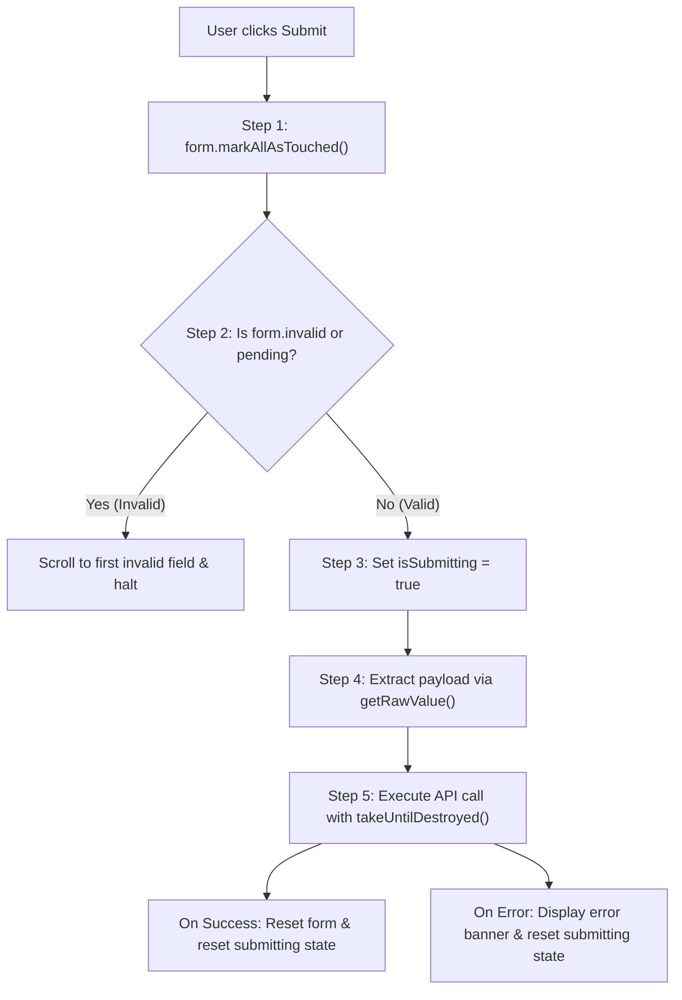

# Signal Interoperability & Enterprise Form Submission Pipeline

## 1. Bridging Reactive Forms to Angular Signals

Angular Signals provide fine-grained reactivity for component UI logic. By bridging Reactive Forms to Signals via `@angular/core/rxjs-interop`, developers can construct clean, reactive derived UI state without manual subscriptions.

### 1.1 `toSignal` Integration Pattern

```typescript
import { Component, ChangeDetectionStrategy, inject, computed } from '@angular/core';
import { FormBuilder, Validators, ReactiveFormsModule } from '@angular/forms';
import { toSignal } from '@angular/core/rxjs-interop';

@Component({
  selector: 'app-checkout-form',
  standalone: true,
  imports: [ReactiveFormsModule],
  changeDetection: ChangeDetectionStrategy.OnPush,
  template: `
    <form [formGroup]="form">
      <input formControlName="promoCode" placeholder="Promo code" />
      <button [disabled]="!isEligibleForDiscount()">Apply Discount</button>
      <p>Summary: {{ discountStatusText() }}</p>
    </form>
  `
})
export class CheckoutFormComponent {
  private readonly fb = inject(FormBuilder).nonNullable;

  readonly form = this.fb.group({
    promoCode: ['', [Validators.required, Validators.minLength(5)]],
    itemsTotal: [150]
  });

  /**
   * Derive a Signal from form valueChanges.
   * ALWAYS provide initialValue from form.getRawValue() to avoid undefined flashes.
   */
  readonly formValues = toSignal(this.form.valueChanges, {
    initialValue: this.form.getRawValue()
  });

  /**
   * Derive a Signal from form statusChanges.
   */
  readonly formStatus = toSignal(this.form.statusChanges, {
    initialValue: this.form.status
  });

  /**
   * Computed reactive UI projection.
   */
  readonly isEligibleForDiscount = computed(() => {
    const values = this.formValues();
    const status = this.formStatus();
    return status === 'VALID' && values.promoCode.startsWith('VIP');
  });

  readonly discountStatusText = computed(() => {
    return this.isEligibleForDiscount()
      ? 'VIP 20% discount will be applied'
      : 'Standard pricing applies';
  });
}
```

---

## 2. Robust Form Submission Protocol

Enterprise applications MUST follow a standardized submission pipeline to ensure visual feedback, prevent duplicate submissions, and accurately serialize disabled fields.

### 2.1 The 5-Step Submission Flow



### 2.2 Complete Submission Implementation

```typescript
import { Component, ChangeDetectionStrategy, inject, signal, ElementRef, DestroyRef } from '@angular/core';
import { FormBuilder, Validators, ReactiveFormsModule } from '@angular/forms';
import { takeUntilDestroyed } from '@angular/core/rxjs-interop';
import { ApiService } from '@core/services/api.service';
import { scrollToFirstInvalidControl } from '../assets/form-submission-helper';

@Component({
  selector: 'app-account-setup',
  standalone: true,
  imports: [ReactiveFormsModule],
  changeDetection: ChangeDetectionStrategy.OnPush,
  template: `
    <form [formGroup]="form" (ngSubmit)="onSubmit()">
      <!-- inputs -->
      <button type="submit" [disabled]="isSubmitting()">
        @if (isSubmitting()) {
          <span>Saving...</span>
        } @else {
          <span>Save Changes</span>
        }
      </button>
    </form>
  `
})
export class AccountSetupComponent {
  private readonly fb = inject(FormBuilder).nonNullable;
  private readonly api = inject(ApiService);
  private readonly el = inject(ElementRef);
  private readonly destroyRef = inject(DestroyRef);

  readonly isSubmitting = signal<boolean>(false);

  readonly form = this.fb.group({
    username: ['', Validators.required],
    department: [{ value: 'Engineering', disabled: true }, Validators.required]
  });

  onSubmit(): void {
    // 1. Mark all controls as touched to trigger CSS & error displays
    this.form.markAllAsTouched();

    // 2. Early return guard
    if (this.form.invalid || this.isSubmitting()) {
      scrollToFirstInvalidControl(this.el.nativeElement);
      return;
    }

    // 3. Set submitting state
    this.isSubmitting.set(true);

    // 4. Extract data using getRawValue() to preserve disabled controls (e.g. department)
    const payload = this.form.getRawValue();

    // 5. Safe HTTP dispatch
    this.api.post('/api/v1/accounts', payload)
      .pipe(takeUntilDestroyed(this.destroyRef))
      .subscribe({
        next: () => {
          this.isSubmitting.set(false);
          this.form.reset();
        },
        error: (err) => {
          this.isSubmitting.set(false);
          console.error('Submission failed', err);
        }
      });
  }
}
```

---

## 3. `.value` vs `.getRawValue()` Gotcha

| Attribute | `form.value` | `form.getRawValue()` |
| :--- | :--- | :--- |
| **Disabled Controls** | **EXCLUDED** from the returned object | **INCLUDED** with their current values |
| **Type Safety** | Partial object `Partial<T>` if controls disabled | Complete typed object `T` |
| **Enterprise Best Practice** | Fragile for API submission | **MANDATORY** for complete backend payloads |

When a control is disabled (e.g. `department: [{ value: 'Finance', disabled: true }]`), calling `form.value` produces `{}` (or omits `department`). This causes backend validation failures (e.g., `department is required`). Always use `this.form.getRawValue()`.
