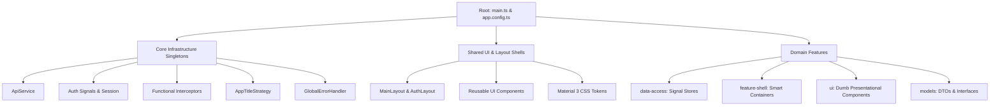

# 14-Point Enterprise Scaffolding Architecture Guide

## 1. Architectural Philosophy
Enterprise Angular applications require strict boundary enforcement, clean domain segregation, and zero tight coupling. This guide defines the canonical 14-Point Enterprise Infrastructure Specification for modern Angular (v19+) codebases running zoneless or OnPush change detection.



---

## 2. The 14-Point Infrastructure Specification

| # | Component / Layer | Location | Purpose & Constraints |
| :--- | :--- | :--- | :--- |
| **1** | **Application Bootstrap Config** | `src/app/app.config.ts` | Configures `provideExperimentalZonelessChangeDetection()`, fetch-enabled `HttpClient`, functional interceptors, and `TitleStrategy`. |
| **2** | **Generic API Service** | `src/app/core/services/api.service.ts` | Centralized typed HTTP wrapper (`get`, `post`, `put`, `patch`, `delete`, `uploadFile`). Zero untyped `any` calls. |
| **3** | **Auth Signals Store** | `src/app/core/services/auth.service.ts` | Manages authentication tokens and session state using Angular Signals (`currentUser()`, `isAuthenticated()`). |
| **4** | **Notification Service** | `src/app/core/services/notification.service.ts` | Signal-driven toast and dialog alert dispatcher for system-wide user notifications. |
| **5** | **Loading Service & Interceptor** | `src/app/core/services/loading.service.ts` | Reactive `isLoading` signal synchronized via HTTP interceptor to display progress bars without race conditions. |
| **6** | **Functional Interceptors** | `src/app/core/interceptors/` | Pure `HttpInterceptorFn` chain (`auth.interceptor`, `error.interceptor`, `loading.interceptor`, `api-prefix.interceptor`). |
| **7** | **Functional Security Guards** | `src/app/core/guards/` | `CanActivateFn` security checkpoints (`auth.guard.ts`, `guest.guard.ts`, `role.guard.ts`) using functional `inject()`. |
| **8** | **App Title Strategy** | `src/app/core/strategies/page-title.strategy.ts` | Subclasses `TitleStrategy` to dynamically sync route snapshot metadata with document `<title>`. |
| **9** | **Global Error Handler** | `src/app/core/handlers/global-error.handler.ts` | Implements Angular `ErrorHandler` for central uncaught exception logging, tracing, and sanitization. |
| **10** | **Base Layout Shells** | `src/app/shared/layouts/` | Standalone UI layout wrappers (`main-layout` with Header/Sidebar/Outlet and `auth-layout`). |
| **11** | **Theme Tokens & SCSS** | `src/styles/_variables.scss` | Material 3 CSS custom properties (`--mat-sys-primary`, `--mat-sys-surface`) and typography scale. |
| **12** | **Bounded Domain Pattern** | `src/app/features/[feature]/` | 4-subfolder domain pattern: `data-access/`, `feature-shell/`, `ui/`, `models/`. |
| **13** | **Clean Directory Layout** | `src/app/` | Clear segregation across `core/`, `shared/`, `features/`, `testing/`, and `styles/`. |
| **14** | **Build & Zero-NgModule Audit** | `package.json` | 100% Standalone architecture verified with zero legacy `NgModule` imports or declarations. |

---

## 3. Directory Layout Matrix

```text
src/
├── app/
│   ├── core/                        # Core Singletons, Interceptors & Guards
│   │   ├── guards/                  # Functional CanActivateFn guards
│   │   ├── interceptors/            # Functional HttpInterceptorFn handlers
│   │   ├── services/                # ApiService, AuthService, NotificationService
│   │   ├── strategies/              # AppTitleStrategy, PreloadStrategy
│   │   └── handlers/                # GlobalErrorHandler
│   │
│   ├── shared/                      # Presentational UI, Layouts & Pipes
│   │   ├── components/              # toast, confirm-dialog, loading-spinner
│   │   ├── layouts/                 # main-layout, auth-layout
│   │   ├── directives/              # has-permission, autofocus
│   │   ├── pipes/                   # truncate, relative-time
│   │   └── validators/              # password-match, no-whitespace
│   │
│   ├── features/                    # Domain-Driven Feature Modules
│   │   └── [domain-feature]/
│   │       ├── data-access/         # Signal stores & API adapters
│   │       ├── feature-shell/       # Container pages & feature.routes.ts
│   │       ├── ui/                  # Dumb presentation components
│   │       └── models/              # TypeScript DTOs, interfaces, and enums
│   │
│   ├── testing/                     # Test doubles, mocks, and fixtures
│   ├── app.config.ts                # Application configuration
│   ├── app.routes.ts                # Top-level application routing
│   └── app.component.ts             # Root application shell
│
└── styles/
    ├── _variables.scss              # CSS custom properties & design tokens
    ├── _typography.scss             # Typography scale & font rules
    ├── _utilities.scss              # Helper CSS utility classes
    └── styles.scss                  # Main SCSS entry point
```

---

## 4. Automated Scaffolding Command

```bash
mkdir -p src/app/core/guards src/app/core/interceptors src/app/core/services src/app/core/strategies src/app/core/handlers
mkdir -p src/app/shared/components/toast-notification src/app/shared/components/confirm-dialog
mkdir -p src/app/shared/components/loading-spinner src/app/shared/components/skeleton-loader
mkdir -p src/app/shared/components/empty-state src/app/shared/components/pagination
mkdir -p src/app/shared/layouts/main-layout src/app/shared/layouts/auth-layout
mkdir -p src/app/shared/directives src/app/shared/pipes src/app/shared/validators
mkdir -p src/app/features src/app/testing src/styles
```
