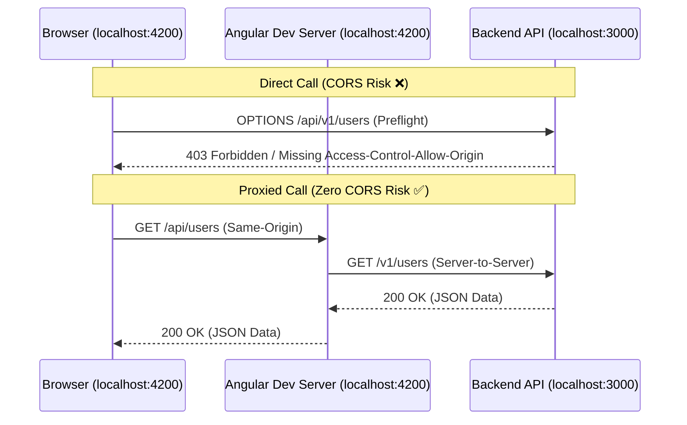

# Angular Reverse Proxy Configuration & CORS Elimination Guide

## 1. The CORS Problem in Local Angular Development
During local frontend development, the Angular CLI development server runs on `http://localhost:4200` while backend APIs (e.g. NestJS, Express, FastAPI) typically run on separate ports (e.g. `http://localhost:3000`, `http://127.0.0.1:8000`).

When the browser executes an HTTP request from origin `localhost:4200` to `localhost:3000`, browser security initiates a **Cross-Origin Resource Sharing (CORS)** preflight check (`OPTIONS` request). If the backend lacks explicit wildcard or credentialed CORS headers, the request is immediately blocked.



---

## 2. Reverse Proxy Configuration Properties

Angular CLI uses `webpack-dev-server` / `vite` internal proxy engines. The proxy configuration schema accepts the following critical flags:

| Property | Type | Default | Description |
| :--- | :--- | :--- | :--- |
| `target` | `string` | *(Required)* | The destination server URL (e.g. `http://localhost:3000` or `https://staging-api.domain.com`). |
| `secure` | `boolean` | `true` | When `false`, ignores self-signed or invalid SSL certificates in development. Set `true` in staging. |
| `changeOrigin` | `boolean` | `false` | When `true`, rewrites the outgoing HTTP `Host` header to match `target`. Essential for virtual hosts. |
| `pathRewrite` | `object` | `{}` | Regular expression mapping to rewrite request paths before forwarding to `target`. |
| `ws` | `boolean` | `false` | When `true`, proxies WebSocket connections (e.g. Socket.io, NestJS Gateways). |
| `logLevel` | `string` | `"info"` | Diagnostic verbosity: `"debug"`, `"info"`, `"warn"`, `"error"`. Set `"debug"` when troubleshooting. |

---

## 3. Advanced Proxy Recipes

### Path Rewriting (`pathRewrite`)
When the frontend uses a clean relative root path `/api` but the backend expects versioned routes like `/api/v1`:

```json
{
  "/api": {
    "target": "http://localhost:3000",
    "secure": false,
    "changeOrigin": true,
    "pathRewrite": {
      "^/api": "/api/v1"
    }
  }
}
```

### Full Duplex WebSocket Proxying
When using NestJS WebSocket Gateways or Socket.io alongside REST endpoints:

```json
{
  "/api": {
    "target": "http://localhost:3000",
    "secure": false,
    "changeOrigin": true
  },
  "/socket.io": {
    "target": "http://localhost:3000",
    "secure": false,
    "changeOrigin": true,
    "ws": true
  }
}
```

### Microservice Multi-Target Proxying
When the frontend communicates with multiple independent backend services:

```json
{
  "/api/auth": {
    "target": "http://localhost:3001",
    "secure": false,
    "changeOrigin": true,
    "pathRewrite": { "^/api/auth": "/v1/auth" }
  },
  "/api/orders": {
    "target": "http://localhost:3002",
    "secure": false,
    "changeOrigin": true,
    "pathRewrite": { "^/api/orders": "/v1/orders" }
  },
  "/api/analytics": {
    "target": "https://staging-analytics.corp.internal",
    "secure": true,
    "changeOrigin": true
  }
}
```
