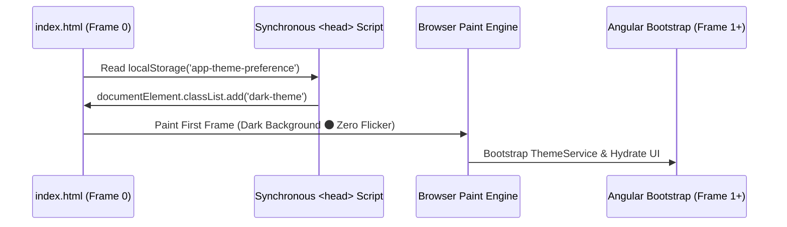

# Dark Mode Default & Zero-FOUC Architecture Guide

## 1. The FOUC Problem in Single Page Applications
A Flash of Unstyled Content (FOUC) or "white flash" occurs when an application configured for Dark Mode initializes asynchronously.

If theme detection runs inside Angular's `ngOnInit()` or a service constructor, the browser renders the default white background for 100–300ms before JavaScript executes and adds `.dark-theme` to `<html>`. This creates jarring visual flicker on page load.



---

## 2. Frame 0 Synchronous Script Protocol
Place a pure, synchronous `<script>` tag inside the `<head>` of `src/index.html` before any CSS stylesheets or script bundles:

```html
<!doctype html>
<html lang="en">
<head>
  <meta charset="utf-8">
  <title>Enterprise Application</title>
  <base href="/">
  <meta name="viewport" content="width=device-width, initial-scale=1">
  
  <!-- Zero-FOUC Frame 0 Script -->
  <script>
    (function() {
      try {
        var theme = localStorage.getItem('app-theme-preference');
        var isDark = theme === 'dark' || (!theme && window.matchMedia('(prefers-color-scheme: dark)').matches);
        document.documentElement.classList.toggle('dark-theme', isDark);
        document.documentElement.classList.toggle('light-theme', !isDark);
      } catch (e) {
        document.documentElement.classList.add('dark-theme');
      }
    })();
  </script>
</head>
```

---

## 3. Signal-Based Reactive `ThemeService`
The Angular `ThemeService` binds user interactions to the document root class and persists preferences across sessions:

```typescript
import { Injectable, signal, effect, inject, DOCUMENT } from '@angular/core';

@Injectable({ providedIn: 'root' })
export class ThemeService {
  private readonly document = inject(DOCUMENT);
  private static readonly STORAGE_KEY = 'app-theme-preference';

  readonly isDarkMode = signal<boolean>(this.getInitialThemePreference());

  constructor() {
    effect(() => {
      const dark = this.isDarkMode();
      const root = this.document.documentElement;
      root.classList.toggle('dark-theme', dark);
      root.classList.toggle('light-theme', !dark);
      try {
        localStorage.setItem(ThemeService.STORAGE_KEY, dark ? 'dark' : 'light');
      } catch {}
    });
  }

  toggleTheme(): void {
    this.isDarkMode.update(prev => !prev);
  }

  private getInitialThemePreference(): boolean {
    try {
      const saved = localStorage.getItem(ThemeService.STORAGE_KEY);
      if (saved) return saved === 'dark';
    } catch {}

    if (typeof window !== 'undefined' && window.matchMedia) {
      if (window.matchMedia('(prefers-color-scheme: light)').matches) return false;
      if (window.matchMedia('(prefers-color-scheme: dark)').matches) return true;
    }

    return true; // Default to Dark Theme
  }
}
```

---

## 4. SSR Platform Guarding
When running in Server-Side Rendered (SSR) environments (such as Angular 19 SSR or Cloudflare Workers), wrap `window.matchMedia` and `localStorage` accesses in `isPlatformBrowser(platformId)` to prevent runtime `ReferenceError` crashes.
