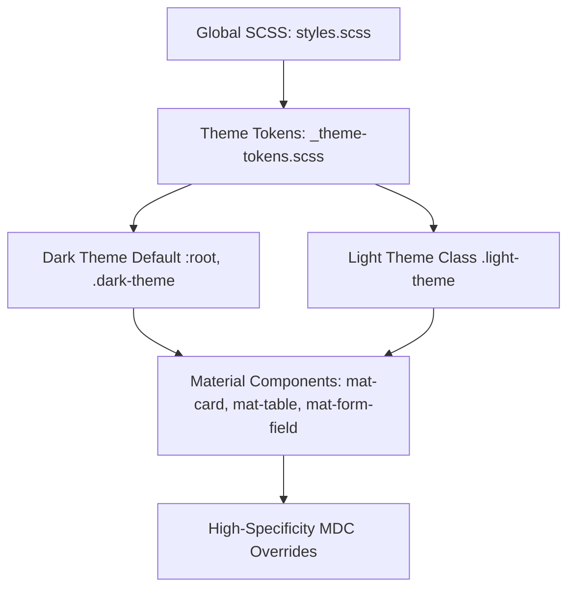

# Angular Material 3 (M3) Theming & Design Tokens Guide

## 1. Material 3 Design Tokens Overview
Angular Material (v19+) uses Material Design 3 (M3) design tokens. All colors, surface elevations, container shapes, and typography states resolve from CSS custom properties prefixed with `--mat-sys-*` or mapped application tokens (`--bg-primary`, `--text-primary`).



---

## 2. High-Specificity MDC Shadow DOM Overrides
Angular Material 3 uses Material Design Components (MDC) internal markup. To guarantee that CSS custom properties override default inline styles in both Light and Dark themes, apply high-specificity rules in global `src/styles.scss`:

```scss
// Card Overrides
mat-card,
.mat-mdc-card {
  background-color: var(--bg-card) !important;
  color: var(--text-primary) !important;
  border: 1px solid var(--border-color) !important;
  border-radius: 12px !important;

  .mat-mdc-card-header,
  .mat-mdc-card-title,
  .mat-mdc-card-subtitle,
  .mat-mdc-card-content {
    color: var(--text-primary) !important;
  }
}

// Form Field Overrides
.mat-mdc-form-field {
  .mat-mdc-text-field-wrapper {
    background-color: var(--bg-card) !important;
  }
  .mat-mdc-form-field-label,
  input.mat-mdc-input-element {
    color: var(--text-primary) !important;
  }
}

// Table Overrides
.mat-mdc-table {
  background-color: var(--bg-card) !important;
  color: var(--text-primary) !important;

  .mat-mdc-header-cell {
    color: var(--text-secondary) !important;
    font-weight: 600;
  }
  .mat-mdc-cell {
    color: var(--text-primary) !important;
  }
}
```

---

## 3. Google Fonts & Typography Integration
1. Embed modern Google Fonts in `index.html`:
```html
<link rel="preconnect" href="https://fonts.googleapis.com">
<link rel="preconnect" href="https://fonts.gstatic.com" crossorigin>
<link href="https://fonts.googleapis.com/css2?family=Inter:wght@400;500;600;700&family=Outfit:wght@500;600;700;800&display=swap" rel="stylesheet">
```

2. Assign font families using CSS variables:
```scss
:root {
  --app-font-heading: 'Outfit', sans-serif;
  --app-font-body: 'Inter', sans-serif;
}

body {
  font-family: var(--app-font-body);
}

h1, h2, h3, h4, h5, h6 {
  font-family: var(--app-font-heading);
}
```

---

## 4. Component Selection & Fallback Rules
- **Material First**: Standard controls (tables, buttons, dialogs, form fields, paginators) MUST use `@angular/material`.
- **Custom Component Fallback**: If Angular Material lacks a specialized control (e.g. advanced signature pad or timeline), custom components MUST consume `var(--bg-card)`, `var(--border-color)`, and `var(--text-primary)` to preserve seamless dark/light switching.
- **Prohibition of Hardcoded Hex**: Never write inline hex colors (e.g. `#1e293b`) inside component SCSS files.
