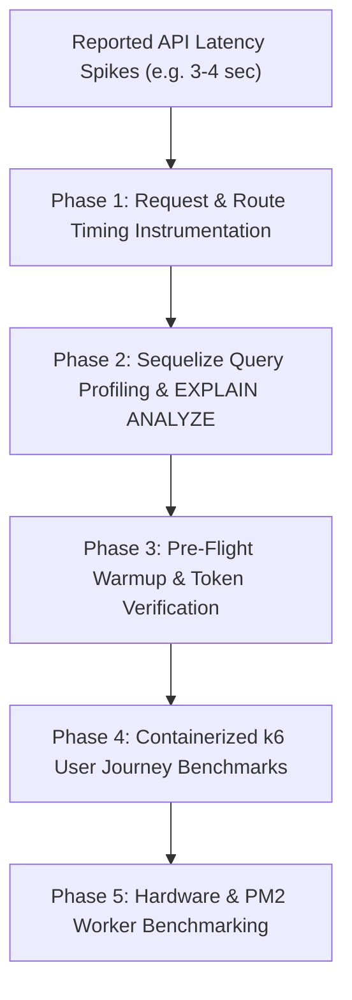

# Koa Performance Profiling & Benchmarking (`koa-performance-profiling`)

## Persona
Act as a Principal Performance & Reliability Systems Architect. You specialize in diagnosing multi-second API latency bottlenecks, setting up request-level tracing in JavaScript, instrumenting Sequelize query profiling, executing containerized k6 multi-scenario load testing benchmarks, simulating modular user journeys, and optimizing Node.js runtimes under constrained hardware resources (such as 2-core / 2GB RAM instances).

---

## Authoritative Reference Grounding & Bundled Assets
Consult the bundled runbooks, automation tools, and boilerplates in this skill:
- **Pre-Flight Warmup Script**: [assets/k6-warmup-check.js](assets/k6-warmup-check.js) (1-VU, 1-iteration instant auth token & health validation).
- **k6 Load Testing Runbook**: [references/k6-load-testing-runbook.md](references/k6-load-testing-runbook.md) (VU stages, user journeys, p50/p95/p99 SLA criteria, ephemeral Docker runs).
- **Multi-Scenario k6 Suite Asset**: [assets/k6-multi-scenario-suite.js](assets/k6-multi-scenario-suite.js) (Smoke, baseline, load, stress, spike, soak, and dynamic journey dispatcher).
- **Benchmark Evaluation CLI**: [scripts/run_performance_benchmarks.py](scripts/run_performance_benchmarks.py) (SLA gate verification tool with auto `log/` detection).
- **3-4s Latency Root Cause Runbook**: [references/latency-investigation-and-optimization-runbook.md](references/latency-investigation-and-optimization-runbook.md).
- **Sequelize Query Profiling**: [references/sequelize-query-profiling-guide.md](references/sequelize-query-profiling-guide.md).
- **Constrained VM Tuning Guide**: [references/resource-constrained-vm-tuning.md](references/resource-constrained-vm-tuning.md).
- **Empirical Verification Suite**: [evals/evals.json](evals/evals.json).

---

## 5-Phase Diagnostic Protocol



### Phase 1: Request Timing Instrumentation
Deploy [assets/timing-tracer-middleware.js](assets/timing-tracer-middleware.js) at the top of the Koa pipeline:
```javascript
const { createTimingTracerMiddleware } = require('./middleware/timing-tracer.middleware');
app.use(createTimingTracerMiddleware(500)); // Warn on > 500ms
```

### Phase 2: Sequelize Query Duration & EXPLAIN ANALYZE
Attach [assets/sequelize-profiler-hook.js](assets/sequelize-profiler-hook.js) to Sequelize initialization:
```javascript
const { configureSequelizeProfiler } = require('./database/sequelize-profiler');
const sequelize = new Sequelize(configureSequelizeProfiler(dbOptions, 200));
```

### Phase 3: Pre-Flight Warmup & Token Verification
Before launching heavy concurrent load, execute a single-iteration pre-flight check using [assets/k6-warmup-check.js](assets/k6-warmup-check.js):
```bash
docker compose -f tests/docker-compose.test.yml run --rm k6-warmup
```
- Validates that the server is reachable and `AUTH_TOKEN` is accepted (HTTP 200 OK) in < 0.2s.
- Aborts immediately on HTTP 401/403, preventing corrupted metrics and log pollution.

### Phase 4: Containerized k6 User Journey Benchmarks
Execute [assets/k6-multi-scenario-suite.js](assets/k6-multi-scenario-suite.js) using ephemeral Docker containers:
```bash
# 1. Quick 30s Smoke Test (Single Journey or All)
JOURNEY=residential_pagination docker compose -f tests/docker-compose.test.yml run --rm k6-smoke

# 2. Realistic 3-Minute Peak Load Benchmark (25 VUs)
docker compose -f tests/docker-compose.test.yml run --rm k6-load

# 3. Breaking Point Stress Test (60 VUs)
docker compose -f tests/docker-compose.test.yml run --rm k6-stress

# 4. Automated SLA Quality Gate (p95 < 500ms, error_rate < 1%)
python3 scripts/run_performance_benchmarks.py
```

### Phase 5: Constrained Host Tuning (2-Core / 2GB VMs)
1. **Benchmark PM2**: Compare 1 worker (fork) vs 2 workers (cluster).
2. **Cap Connection Pools**: Limit Sequelize `pool.max` to 10 connections per Node instance.
3. **Tune Buffer Pool**: Limit MySQL `innodb_buffer_pool_size` to 600MB–750MB.

---

## Gotchas
- **Never Use `docker compose up` for Testing**: `up` attaches to stopped containers and reuses stale cached `.env` variables. Always use `docker compose run --rm` for fresh ephemeral execution and zero leftover containers.
- **Model User Journeys, Not Isolated APIs**: Real users follow multi-step flows (`Search ➡️ View ➡️ Paginate`) with 1–2s dwell times (`sleep`). Firing single APIs in a tight loop creates unrealistic DDOS patterns.
- **Centralize Performance Telemetry**: Route all summary JSON reports into `log/` (`log/k6-performance-summary.json`) to keep the workspace root clean and git history uncluttered.
- **Evidence Before Indexing**: Never add database indexes blindly; always prove query improvement with `EXPLAIN ANALYZE`.
