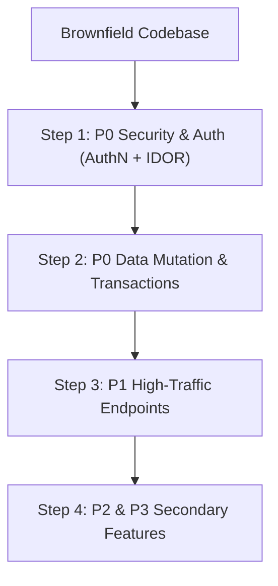

# Production Test Prioritization Matrix (P0–P3)

## Purpose
When introducing tests into an existing un-tested production backend, attempting to write hundreds of tests simultaneously leads to fatigue, missed deadlines, and brittle test suites. This matrix establishes a risk-weighted prioritization protocol.

---

## 1. Classification Criteria

| Priority Level | Classification | Target Scope | Impact of Failure | Coverage Mandate |
| :--- | :--- | :--- | :--- | :--- |
| **P0** | **Critical** | Authentication, authorization guards, financial transactions, destructive data mutations | Total outage, financial loss, data breach, security vulnerability | 100% path coverage across Unit + Integration + API |
| **P1** | **High** | High-traffic search endpoints, core entity CRUD, pagination, webhook handlers | Degraded user experience, broken customer workflow | API + DB Integration tests |
| **P2** | **Medium** | Secondary reporting, user profile edits, email notifications, utility algorithms | Annoyance, minor workflow delay | Unit tests + Selected API tests |
| **P3** | **Low** | Health checks, static lookups, admin informational views | Minimal business impact | Smoke API test only |

---

## 2. Real-World Koa Example Classification

### P0 (Critical - Must Implement First)
- `POST /api/auth/login` (Authentication, JWT issuance, password verification)
- `POST /api/checkout/charge` (Stripe payment, transaction rollback on failure)
- `DELETE /api/properties/:id` (Authorization check, IDOR protection against cross-user deletions)
- `POST /api/orders` (Multi-table transaction inserting order, items, and inventory reduction)

### P1 (High - Next Priority)
- `GET /api/properties` (Filters, pagination boundaries, eager loads)
- `PUT /api/users/me` (Profile update, input validation boundaries)
- `POST /api/leads` (Lead submission, notification dispatch)

### P2 (Medium)
- `GET /api/reports/monthly` (Aggregated statistics, slow queries)
- `POST /api/contact` (Contact form submission, email queue)

### P3 (Low)
- `GET /api/health` (Simple uptime ping)
- `GET /api/cities` (Static dropdown lookup values)

---

## 3. Implementation Order Protocol

*Golden Rule*: Never write P2 or P3 tests until all P0 endpoints have passing Supertest API tests with authentication, authorization, and validation assertions.
