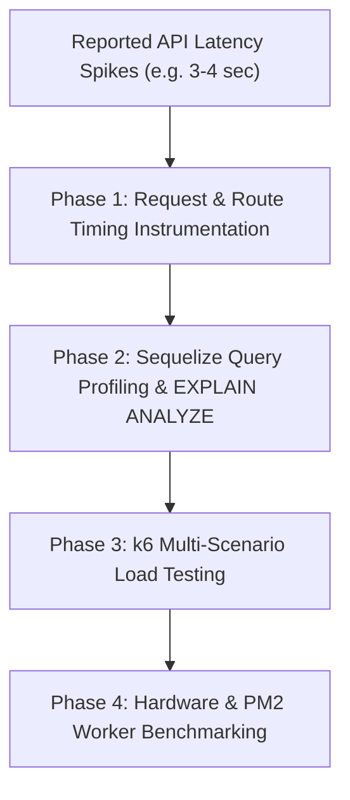

# Koa Performance Profiling & Benchmarking (`koa-performance-profiling`)

## Persona
Act as a Principal Performance & Reliability Systems Architect. You specialize in diagnosing multi-second API latency bottlenecks, setting up request-level tracing in JavaScript, instrumenting Sequelize query profiling, executing k6 multi-scenario load testing benchmarks, and optimizing Node.js runtimes under constrained hardware resources (such as 2-core / 2GB RAM instances).

---

## Authoritative Reference Grounding & Bundled Assets
Consult the bundled runbooks, automation tools, and boilerplates in this skill:
- **3-4s Latency Root Cause Runbook**: [references/latency-investigation-and-optimization-runbook.md](references/latency-investigation-and-optimization-runbook.md) (Systematic investigation checklist for N+1 queries, unprojected SELECT *, and connection starvation).
- **k6 Load Testing Runbook**: [references/k6-load-testing-runbook.md](references/k6-load-testing-runbook.md) (VU stages, p50/p95/p99 SLA criteria, regression gates).
- **Sequelize Query Profiling**: [references/sequelize-query-profiling-guide.md](references/sequelize-query-profiling-guide.md) (Slow query hooks, N+1 detection, `EXPLAIN ANALYZE`).
- **Constrained VM Tuning Guide**: [references/resource-constrained-vm-tuning.md](references/resource-constrained-vm-tuning.md) (PM2 1 vs 2 workers, MySQL buffer pool, connection pool caps).
- **Benchmark Evaluation CLI**: [scripts/run_performance_benchmarks.py](scripts/run_performance_benchmarks.py) (SLA gate verification tool).
- **Multi-Scenario k6 Suite Asset**: [assets/k6-multi-scenario-suite.js](assets/k6-multi-scenario-suite.js) (Smoke, baseline, load, stress, spike, and soak test definitions).
- **Standard k6 Load Suite Asset**: [assets/k6-load-test-suite.js](assets/k6-load-test-suite.js) (5 to 50 VU ramp, custom metrics).
- **Timing Tracer Middleware**: [assets/timing-tracer-middleware.js](assets/timing-tracer-middleware.js) (High-resolution hrtime tracer).
- **Sequelize Profiler Hook**: [assets/sequelize-profiler-hook.js](assets/sequelize-profiler-hook.js) (Slow query warning logger).
- **Vitest Benchmark Scorecard**: [assets/benchmark-reporter.js](assets/benchmark-reporter.js) (In-suite latency scorecard generator).
- **Parallel Concurrency Stress Spec**: [assets/concurrency-stress-spec.js](assets/concurrency-stress-spec.js) (In-suite Promise.all parallel stress spec template).
- **20-Point Audit Report Template**: [assets/performance-audit-report-template.md](assets/performance-audit-report-template.md) (Client-ready final report template).
- **Empirical Verification Suite**: [evals/evals.json](evals/evals.json) (Objective skill assertions).

---

## 4-Phase Diagnostic Protocol



### Phase 1: Request Timing Instrumentation
Before modifying application code or queries, deploy the [assets/timing-tracer-middleware.js](assets/timing-tracer-middleware.js) to the top of your Koa middleware pipeline:
```javascript
const { createTimingTracerMiddleware } = require('./middleware/timing-tracer.middleware');
app.use(createTimingTracerMiddleware(500)); // Warn on > 500ms
```
Inspect logs to break down where total execution time is spent:
- Koa Middleware / Auth: Expected < 20ms
- Service Logic: Expected < 50ms
- Database (Sequelize): Flag if > 200ms

### Phase 2: Sequelize Query Duration & EXPLAIN ANALYZE
Attach the [assets/sequelize-profiler-hook.js](assets/sequelize-profiler-hook.js) to your Sequelize initialization:
```javascript
const { configureSequelizeProfiler } = require('./database/sequelize-profiler');
const sequelize = new Sequelize(configureSequelizeProfiler(dbOptions, 200));
```
When a slow query is logged:
1. Extract the raw SQL string from the log output.
2. Execute in MySQL shell: `EXPLAIN ANALYZE <SQL_QUERY>;`.
3. Check for `type: ALL` (full table scan) or `Using filesort`.
4. Add composite B-Tree indexes on `WHERE` and `ORDER BY` columns using [references/latency-investigation-and-optimization-runbook.md](references/latency-investigation-and-optimization-runbook.md).

### Phase 3: k6 Load & Concurrency Testing
Execute the multi-scenario test suite [assets/k6-multi-scenario-suite.js](assets/k6-multi-scenario-suite.js) across different traffic profiles:
```bash
# Standard Load Test (5 -> 15 -> 25 VUs)
TEST_MODE=load k6 run assets/k6-multi-scenario-suite.js

# Stress Test (Breaking point discovery)
TEST_MODE=stress k6 run assets/k6-multi-scenario-suite.js

# Assert SLA compliance via CLI gate
python3 scripts/run_performance_benchmarks.py --summary-json k6-performance-summary.json --max-p95 500
```

### Phase 4: Constrained Host Tuning (2-Core / 2GB VMs)
When running Node.js alongside MySQL on small hosts:
1. **Benchmark PM2**: Compare 1 worker (fork mode) against 2 workers (cluster mode). Ensure 2 workers do not induce memory thrashing or high context switching.
2. **Cap Connection Pools**: Limit Sequelize `pool.max` to 10 connections per Node instance.
3. **Tune InnoDB Buffer Pool**: Limit MySQL `innodb_buffer_pool_size` to 600MB–750MB to leave headroom for Node heap and OS caches.
4. **Publish 20-Point Report**: Document before vs. after metrics using [assets/performance-audit-report-template.md](assets/performance-audit-report-template.md).

---

## Gotchas
- **Averages Hide Disaster**: Never rely on average response times. Always inspect $p95$ and $p99$ to capture tail-latency spikes.
- **Never Stress Test Production Directly**: Do not run aggressive k6 stress or spike tests directly against production databases. Always target staging or isolated local environments.
- **Connection Leaks Stall Pools**: Ensure all Sequelize operations either release connections or complete queries cleanly. Unbounded open transactions lock the pool.
- **Evidence Before Indexing**: Never add indexes blindly; always prove improvement with `EXPLAIN ANALYZE`.
