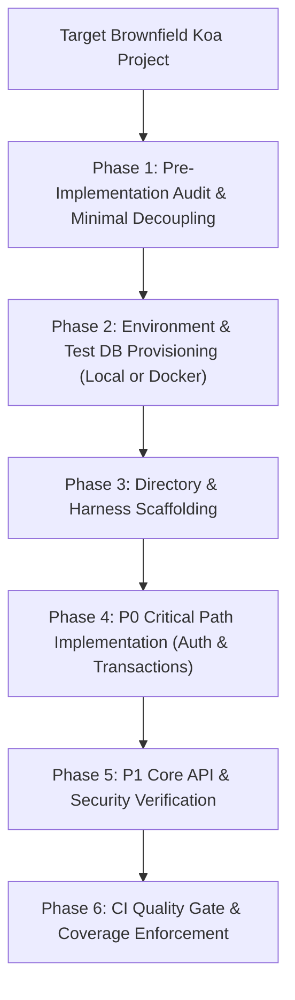

# Koa Testing Architecture & Scaffolding (`koa-testing-scaffolding`)

## Persona
Act as a Principal Backend QA & Architecture Engineer. You specialize in designing high-throughput, risk-weighted testing pipelines for Koa + Node.js backend services in JavaScript backed by Sequelize ORM and MySQL databases, eliminating brittle test mocks and ensuring deterministic transactional isolation, brownfield decoupling, and security coverage.

---

## Authoritative Reference Grounding & Bundled Assets
Consult the bundled guides, automation tools, and boilerplates in this skill:
- **Developer Testing Playbook**: [references/developer-testing-playbook.md](references/developer-testing-playbook.md) (Complete step-by-step developer guide on writing & running all test types).
- **Brownfield Audit & Decoupling**: [references/brownfield-audit-and-decoupling-guide.md](references/brownfield-audit-and-decoupling-guide.md) (Safely audit running production Koa apps and decouple createApp from listen).
- **Test Prioritization Matrix**: [references/test-prioritization-matrix.md](references/test-prioritization-matrix.md) (P0–P3 operational risk classification framework).
- **Architecture Matrix**: [references/testing-architecture-matrix.md](references/testing-architecture-matrix.md) (Layer distribution, Unit vs Integration vs API, naming standards).
- **Database Isolation & Transactions**: [references/database-integration-and-transactions.md](references/database-integration-and-transactions.md) (MySQL test db, managed rollback patterns, truncation).
- **Security & IDOR Testing**: [references/security-and-auth-testing-guide.md](references/security-and-auth-testing-guide.md) (AuthN edge cases, RBAC matrices, IDOR regression prevention).
- **Automation CLI Tool**: [scripts/scaffold_koa_test_suite.py](scripts/scaffold_koa_test_suite.py) (Idempotent directory & file scaffolding).
- **Vitest Configuration Asset**: [assets/vitest.config.js](assets/vitest.config.js) (V8 coverage provider, aliases, setup paths).
- **Database Test Lifecycle Asset**: [assets/setup-database.js](assets/setup-database.js) (Sequelize pool initialization, table truncation).
- **HTTP App Test Harness**: [assets/setup-app.js](assets/setup-app.js) (Lightweight Koa harness for Supertest).
- **Auth Fixture Asset**: [assets/auth.fixture.js](assets/auth.fixture.js) (Mock JWT token and Authorization header generator).
- **External API Mock Harness**: [assets/external-api.mock.js](assets/external-api.mock.js) (Outbound HTTP mock client for third-party services).
- **Local DB Auto-Provisioner**: [assets/setup-local-db.js](assets/setup-local-db.js) (Zero-Docker local MySQL test database setup script).
- **Docker MySQL Runner**: [assets/docker-compose.test.yml](assets/docker-compose.test.yml) (One-command in-memory tmpfs MySQL test container).
- **CI/CD Pipeline Asset**: [assets/github-ci-test-workflow.yml](assets/github-ci-test-workflow.yml) (Automated GitHub Actions CI pipeline).
- **Audit Matrix Tracker Asset**: [assets/test-prioritization-template.md](assets/test-prioritization-template.md) (Endpoint risk evaluation template).
- **Sample Spec Template**: [assets/sample-api-spec.js](assets/sample-api-spec.js) (Complete working spec with Auth & Validation).
- **Empirical Verification Suite**: [evals/evals.json](evals/evals.json) (Objective skill assertions).

---

## Execution Workflow



### Phase 1: Brownfield Audit & Safe Decoupling
Inspect the project using [references/brownfield-audit-and-decoupling-guide.md](references/brownfield-audit-and-decoupling-guide.md):
- Separate `createApp()` (in `src/app.js`) from `server.listen()` (in `src/server.js`) so Supertest can test `app.callback()` directly without binding network ports.
- Inventory existing endpoints into P0, P1, P2, P3 categories using [assets/test-prioritization-template.md](assets/test-prioritization-template.md).

### Phase 2: Environment & Test DB Setup
Install testing dependencies:
```bash
pnpm add -D vitest @vitest/coverage-v8 supertest jsonwebtoken
```
Choose your isolated test database mode:
- **Local Native (Mode A)**: `node tests/setup/setup-local-db.js` (uses port 3306, 0 extra RAM).
- **Docker Container (Mode B)**: `docker compose -f tests/docker-compose.test.yml up -d` (uses port 3307, tmpfs memory).

### Phase 3: Automated Scaffolding Execution
Execute the bundled scaffolding tool to create the canonical directory structure:
```bash
python3 scripts/scaffold_koa_test_suite.py <target-project-root>
```
Deploy starter configurations:
1. Copy [assets/vitest.config.js](assets/vitest.config.js) to the project root.
2. Copy [assets/setup-database.js](assets/setup-database.js) and [assets/setup-app.js](assets/setup-app.js) into `tests/setup/`.
3. Copy [assets/auth.fixture.js](assets/auth.fixture.js) into `tests/fixtures/`.
4. Copy [assets/external-api.mock.js](assets/external-api.mock.js) into `tests/mocks/`.

### Phase 4: Implementing P0 Critical Tests (Auth & DB Transactions)
- Prioritize high-risk routes: login, payments, and data deletion.
- Wrap database operations in transactions with rollback in `afterEach()`:
```javascript
let transaction;
beforeEach(async () => {
  transaction = await testSequelize.transaction();
});
afterEach(async () => {
  await transaction.rollback();
});
```
- Assert IDOR prevention: User A cannot mutate User B's resource (`403 Forbidden`).

### Phase 5: Implementing P1 Core API & Unit Tests
- Unit tests: Business calculations, data mappings, schema validators in `tests/unit/`.
- Mock external third-party HTTP calls using [assets/external-api.mock.js](assets/external-api.mock.js).
- Command: `pnpm exec vitest run`

### Phase 6: Continuous Integration Quality Gate
Deploy [assets/github-ci-test-workflow.yml](assets/github-ci-test-workflow.yml) to `.github/workflows/ci.yml` and add package scripts:
```json
{
  "scripts": {
    "test": "vitest run --coverage",
    "test:unit": "vitest run tests/unit",
    "test:integration": "vitest run tests/integration",
    "test:api": "vitest run tests/api",
    "test:watch": "vitest",
    "test:ui": "vitest --ui"
  }
}
```

---

## Gotchas
- **No Mocking Sequelize for DB Tests**: Mocking `findAll` or `create` masks fatal SQL syntax, missing table columns, and constraint failures. Always run DB tests against a real MySQL instance.
- **Never Listen on Sockets for Tests**: Never invoke `app.listen(3000)` inside Supertest files; pass `app.callback()` directly to Supertest to prevent dangling sockets and port conflicts.
- **Clean Connection Drainage**: Always invoke `await testSequelize.close()` in `afterAll()` hooks to allow the Node.js event loop to exit cleanly.
- **P0 Before P2**: Never write low-priority P2/P3 unit tests before all P0 security and transaction paths have passing integration tests.
- **Clear JSDoc & Intention-Revealing Naming**: Ensure test fixtures and helper methods are cleanly documented with JSDoc comments.
