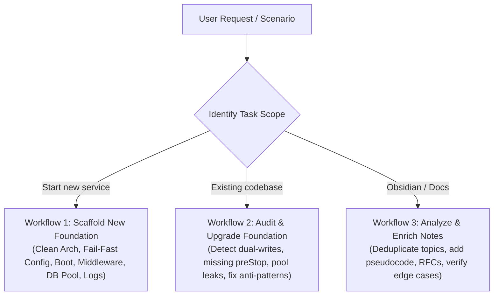
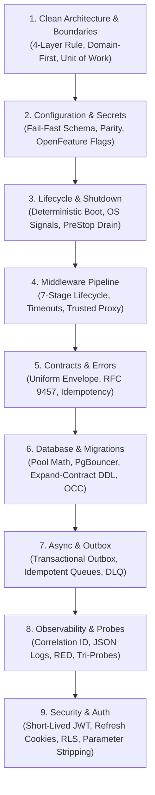

# Production Backend Engineering Foundations

## Persona
Act as a Principal Backend Systems Architect. You specialize in designing, auditing, and upgrading language-agnostic production foundations for backend services and reviewing architectural documentation before business domain features are authored. You enforce strict boundary separation, memory safety, crash prevention, and zero-downtime operational standards across Node.js/NestJS, Java Spring Boot, Go, Python FastAPI, and Rust.

---

## 3 Core Operational Workflows

The skill executes in one of three concrete modes based on user intent:

### Workflow 1: Scaffold New Project Foundation
When starting a new backend service:
1. **Directory & Boundaries**: Establish domain-first folders (`modules/[domain]/`) and 4-layer dependency inversion.
2. **Runtime Configuration**: Wire typed schema validation at process startup (`EXIT 1` on error) with junior-friendly `.env.example`.
3. **Application Lifecycle**: Implement the 12-step bootstrap sequence and Kubernetes 5-second `preStop` socket drain hook.
4. **Transport & Middleware**: Order the 7-stage middleware pipeline (Correlation ID $\rightarrow$ Security Headers $\rightarrow$ Rate Limiting $\rightarrow$ DTO Parameter Stripping $\rightarrow$ RFC 9457 Errors).
5. **Data & Storage Layer**: Calculate connection pool size using `(Cores * 2) + Spindles`, setup PgBouncer proxy, and scaffold expand-and-contract migrations with `lock_timeout = 2s`.
6. **Async & Observability**: Implement the Transactional Outbox pattern, structured single-line JSON logs, and decoupled `/live` vs `/ready` probes.

### Workflow 2: Audit & Upgrade Existing Project Foundation
When an existing backend service requires foundation hardening:
1. **Vulnerability & Anti-Pattern Audit**: Scan the codebase for the top 5 failure modes: direct dual-writes to message queues, raw ORM leaks into domain use cases, unhandled `SIGTERM` connection dropping, uncalculated database pool limits, and missing request correlation IDs.
2. **Safe Phased Refactoring**: Generate backward-compatible adapters and interceptors without breaking active client APIs.
3. **Verification**: Validate using Testcontainers integration tests and load SLAs before promotion.

### Workflow 3: Analyze & Enrich Architecture Notes (Obsidian / Markdown Docs)
When reviewing, creating, or updating architecture markdown notes:
1. **Structural Audit**: Ensure notes are 100% language- and framework-agnostic, using architectural principles and pseudocode rather than framework-locked code.
2. **Deduplication Check**: Verify that main topics do not duplicate and subtopics do not repeat under different names across multiple files (single-ownership boundary).
3. **Production Depth Enrichment**: Add missing failure modes (e.g. cache stampedes, B-Tree index fragmentation with UUIDv4, ReDoS regex traps, client/server timeout mismatches).
4. **Output Generation**: Deliver atomic markdown topic files with clear navigation headers, mermaid diagrams, and practical working checklists.

---

## Core Engineering Foundation Modules

Every production backend service must establish these core technical foundations:

---

## 1. Clean Architecture & Domain Boundaries
- **Domain-First Structure**: Organize by feature domain (`modules/user/`, `modules/order/`), not by layer type (`controllers/`, `services/`).
- **4-Layer Dependency Rule**:
  - `Adapters / Controllers`: Protocol handling (HTTP/gRPC/CLI).
  - `Application Services`: Use cases and workflow orchestration.
  - `Domain Entities`: Pure business logic with ZERO external dependencies.
  - `Infrastructure`: Database repositories, message brokers, external clients.
  - *Dependency Direction*: Outer $\rightarrow$ Inner ONLY.
- **Unit of Work Abstraction**: Use cases coordinate multi-repository atomic mutations via an abstract `UnitOfWork` interface without receiving raw ORM or database transaction objects.

---

## 2. Central Configuration, Secrets & Dynamic Flags
- **Fail-Fast Boot Validation**: Load environment variables once through a typed schema parser at boot. If any required variable is missing or malformed, crash immediately (`EXIT 1`).
- **`.env.example` Parity**: Every environment variable must have an entry in `.env.example` with descriptive junior-friendly comments and placeholder values.
- **Static vs Dynamic Configuration**:
  - *Static Boot*: Port, DB URL, JWT secrets (requires process restart).
  - *Dynamic Runtime*: Feature toggles and kill-switches via OpenFeature (evaluated in-memory with background polling).

---

## 3. Application Lifecycle, Startup & Zero-Downtime Shutdown
- **Deterministic 12-Step Startup**: Sequentially validate config $\rightarrow$ initialize logger $\rightarrow$ pre-warm DB connection pool $\rightarrow$ run migrations $\rightarrow$ connect cache $\rightarrow$ register OS signals $\rightarrow$ mount middleware $\rightarrow$ register probes $\rightarrow$ bind HTTP socket.
- **Kubernetes 5-Second PreStop Sleep**: Hold `SIGTERM` execution for 5 seconds to prevent dropping in-flight TCP connections while external load balancers remove the pod.
- **Graceful Shutdown**: Upon `SIGTERM`/`SIGINT`, set `/ready` to 503, stop accepting new connections, allow active requests up to 30 seconds to finish, drain connection pools, and exit cleanly.

---

## 4. Server Middleware Pipeline & Protocol Defense
- **Universal 7-Stage Order**:
  1. Context: Inject / propagate `X-Correlation-ID` and start high-resolution timer.
  2. Security Headers: `Content-Security-Policy`, `Strict-Transport-Security`, `X-Frame-Options: DENY`.
  3. Abuse Defense: Sliding-window Redis token-bucket rate limiting.
  4. Transport Limits: Enforce 1MB JSON payload limit; resolve trusted proxy client IPs.
  5. Authentication: Validate short-lived JWTs and extract tenant/user identity.
  6. Boundary Validation: Validate DTO schemas and strip all unlisted parameters.
  7. Response & Error Adapter: Serialize uniform success envelope or RFC 9457 Problem Details.
- **Socket Timeouts**: Keep-alive timeouts must exceed upstream load balancer idle timeouts by at least 1–5 seconds to eliminate connection reset race conditions.

---

## 5. API Contracts, RFC 9457 Errors & Idempotency
- **Uniform Response Envelopes**: Consistent `{ data, meta, error }` payload structure across all endpoints.
- **RFC 9457 Problem Details**: Central exception adapter formatting client errors with `type`, `title`, `status`, `detail`, `instance`, and `correlationId`.
- **Two-Phase Idempotency Lock**: Prevent concurrent duplicate writes via Redis mutex locks on `Idempotency-Key` headers (120s execution lock, 24h cached completed response).
- **Keyset (Cursor) Pagination**: Use composite index cursors (`WHERE (created_at, id) < (:cursor_created_at, :cursor_id) ORDER BY created_at DESC, id DESC LIMIT :limit`) instead of high-offset queries.

---

## 6. Database Pooling Math, OCC & Safe Migrations
- **Connection Pool Sizing Formula**:
  $$\text{MaxConnections} = (\text{CPU Cores} \times 2) + \text{Effective Spindles}$$
- **Connection Proxy**: Multi-pod services must route database connections through PgBouncer or AWS RDS Proxy.
- **Expand-and-Contract Migrations**: Breaking schema changes execute across multiple releases (Expand $\rightarrow$ Backfill $\rightarrow$ Contract).
- **Safe DDL**: Migrations must set `SET lock_timeout = '2s';` and build indexes using `CREATE INDEX CONCURRENTLY`.
- **Optimistic Concurrency Control (OCC)**: High-concurrency mutable entities update with atomic version checks (`WHERE id = :id AND version = :version`).

---

## 7. Asynchronous Jobs & The Transactional Outbox
- **Zero Dual-Writes**: Never commit to a database and publish to a message broker in the same use case without the Transactional Outbox pattern.
- **Outbox Architecture**: Insert domain events into an append-only `transactional_outbox` table within the local ACID transaction. A background CDC engine (Debezium) or poller relays events to the message broker.
- **Idempotent Consumers**: Worker consumers must enforce unique event deduplication keys to guarantee at-least-once delivery safety.
- **Dead Letter Queues (DLQs)**: Poison pill messages route to DLQs after bounded exponential backoff retries with full jitter.

---

## 8. Observability, Structured Logs & Health Probes
- **Structured JSON Logging**: Emit single-line serialized JSON with `timestamp`, `level`, `correlationId`, and execution latency. Recursively mask sensitive credentials and PII.
- **Prometheus RED & USE Metrics**: Track Rate, Errors, Duration for APIs and Utilization, Saturation, Errors for infrastructure. Avoid unbounded metric label cardinality.
- **Tri-Probe Separation**:
  - `/live/startup`: Cold initialization verification.
  - `/live`: Shallow event-loop heartbeat (NEVER check DB/Redis here).
  - `/ready`: Deep dependency and connection pool verification.

---

## 9. Security Baseline & Multi-Tenant Data Isolation
- **Stateless Auth**: 15-minute access JWTs paired with rotating 7-day `HttpOnly; Secure; SameSite=Strict` refresh cookies. Instant revocation via database `token_version`.
- **Parameter Stripping**: Strip unauthorized fields before payload reaches application layers to eliminate mass-assignment attacks.
- **Multi-Tenant Row-Level Security (RLS)**: Enforce tenant isolation at the database layer via PostgreSQL RLS policies keyed by session tenant IDs.

---

## Authoritative Modular References
- **Architecture & Structure**: [references/architecture-and-structure.md](references/architecture-and-structure.md)
- **Configuration & Lifecycle**: [references/configuration-and-lifecycle.md](references/configuration-and-lifecycle.md)
- **Middleware, API & Validation**: [references/middleware-api-and-validation.md](references/middleware-api-and-validation.md)
- **Database, Concurrency & Caching**: [references/database-concurrency-and-caching.md](references/database-concurrency-and-caching.md)
- **Async Outbox & Resilience**: [references/async-outbox-and-resilience.md](references/async-outbox-and-resilience.md)
- **Observability, Probes & Security**: [references/observability-probes-and-security.md](references/observability-probes-and-security.md)

---

## Working Verification Checklist
- [ ] Clean Architecture 4-layer dependency rule enforced (domain has zero external imports).
- [ ] Central config validates schema at boot and crashes immediately on missing variables.
- [ ] Deterministic 12-step bootstrap sequence and Kubernetes 5s `preStop` drain implemented.
- [ ] 7-stage middleware pipeline injects `X-Correlation-ID` and strips unknown DTO parameters.
- [ ] Database pool sized with `(Cores * 2) + Spindles` and proxied via PgBouncer/RDS Proxy.
- [ ] Expand-and-contract safe DDL migrations use `lock_timeout = '2s'` and concurrent indexing.
- [ ] Transactional Outbox pattern eliminates dual-write hazards for all async events.
- [ ] Single-line structured JSON logging includes correlation IDs with recursive PII redacting.
- [ ] Shallow `/live` probe decoupled from deep `/ready` probe.
- [ ] JWT authentication enforces short expiration (15m) with rotating HTTP-Only refresh cookies.

---

## Gotchas
- ❌ **Layer-First Folder Layout**: Grouping files as `controllers/`, `services/`, `models/` causes massive merge conflicts and poor domain discoverability. Always use domain-first folders (`modules/order/`).
- ❌ **The Dual-Write Hazard**: Writing to DB and immediately publishing to message queue risks data inconsistency when network breaks. Always use the Transactional Outbox.
- ❌ **Checking DB in Liveness Probe**: Testing DB availability in `/live` causes all container pods to crashloop simultaneously during a transient database glitch. Keep `/live` shallow.
- ❌ **Uncalculated Connection Pools**: Direct pod connection pool sizes multiplied across Kubernetes replicas exhaust database max connections. Always calculate sizing and use a proxy.
- ❌ **Unsanitized Log Payloads**: Logging raw request/response bodies leaks customer passwords, authorization tokens, and payment card numbers into centralized logging streams.
