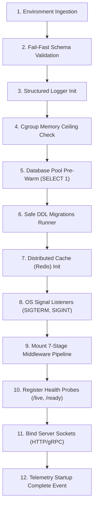

# Central Configuration, Application Lifecycle & Zero-Downtime Shutdown

## 1. Fail-Fast Boot Configuration

Applications must validate configuration at the start of execution. Any missing or malformed environment variable must terminate the process immediately (`EXIT 1`).

```text
FUNCTION BootstrapConfiguration():
    RawConfig = ReadEnvironmentVariables()
    
    // Strict schema enforcement
    Schema = ObjectSchema({
        PORT: Integer().min(1024).max(65535).default(3000),
        DATABASE_URL: String().required().isUri(),
        DATABASE_POOL_SIZE: Integer().min(2).max(50).default(10),
        JWT_SECRET: String().min(32).required(),
        JWT_EXPIRES_IN: String().default("15m"),
        REDIS_URL: String().required().isUri()
    })
    
    Result = Schema.validate(RawConfig)
    IF Result.hasErrors():
        PrintToStderr("FATAL: Environment configuration validation failed:\n" + Result.errors)
        OS.EXIT(1)
        
    RETURN FrozenImmutable(Result.data)
```

---

## 2. Dynamic Runtime Feature Flags (OpenFeature)

Static boot configuration requires process restarts. Dynamic flags allow immediate runtime toggles (kill-switches, canary releases) without deployments.

```text
// Vendor-neutral OpenFeature interface
featureClient = OpenFeature.getClient()

isNewPaymentGatewayActive = featureClient.getBooleanValue(
    "enable-new-payment-gateway",
    false,                         // Safe default fallback
    {"userId": userId, "tenantId": tenantId}
)

IF isNewPaymentGatewayActive:
    executeNewGateway(payment)
ELSE:
    executeLegacyGateway(payment)
```

---

## 3. The 12-Step Deterministic Startup Sequence



---

## 4. Zero-Downtime Graceful Shutdown & Kubernetes PreStop Drain

### The Kubernetes Invariant
When a pod receives `SIGTERM`, external load balancers still take 1–3 seconds to update endpoints. The pod MUST wait 5 seconds before closing sockets:

```yaml
# Kubernetes Pod Spec
lifecycle:
  preStop:
    exec:
      command: ["/bin/sleep", "5"]
```

### Shutdown Algorithm
```text
ON_SIGNAL(SIGTERM, SIGINT):
    LOG_INFO("Received shutdown signal. Initiating graceful teardown.")
    
    // Step 1: Invalidate Readiness Probe -> K8s stops routing new traffic
    HealthState.setReady(FALSE)
    
    // Step 2: Stop accepting new TCP socket connections
    Server.stopListening()
    
    // Step 3: Bounded drain period for in-flight requests (30s max)
    DrainTimer = StartTimer(30_SECONDS)
    WHILE ActiveRequests.count() > 0 AND NOT DrainTimer.isExpired():
        Sleep(100ms)
        
    // Step 4: Gracefully terminate background connections
    BackgroundWorkers.stopConsumers()
    DatabasePool.drainAndClose()
    CacheClient.close()
    
    LOG_INFO("Graceful shutdown completed successfully.")
    OS.EXIT(0)
```
