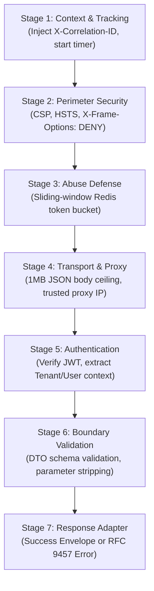

# Server Middleware Pipeline, API Contracts & RFC 9457 Errors

## 1. The Ordered 7-Stage Middleware Pipeline



---

## 2. Global Error Handling & RFC 9457 Problem Details

All application errors must be translated centrally into standard RFC 9457 Problem Details objects:

```json
{
  "type": "https://api.example.com/errors/resource-not-found",
  "title": "Resource Not Found",
  "status": 404,
  "detail": "Order with identifier 018e3f2a-bc91-7890-a123-456789abcdef does not exist.",
  "instance": "/api/v1/orders/018e3f2a-bc91-7890-a123-456789abcdef",
  "correlationId": "018e3f2a-bc91-7890-a123-456789abcdef",
  "invalidParams": []
}
```

### Operational vs Programmer Errors
- **Operational Errors** (Client invalid inputs, missing resources, credit card declined): Return structured $4\text{xx}$ responses with clear messages.
- **Programmer Errors** (Null pointer exceptions, database syntax bugs, unexpected crashes): Return opaque HTTP 500 (`Internal Server Error`), emit alert telemetry, and redact all internal stack traces from the client response.

---

## 3. Boundary Validation & Parameter Stripping

### Mass-Assignment Attack Prevention
Attackers pass unauthorized properties (e.g. `{"isAdmin": true}`) in JSON payloads. The validation layer must strictly strip all unlisted fields:

```text
FUNCTION ValidateAndStripInput(RawInput, Schema):
    SanitizedData = {}
    FOR FieldName IN Schema.allowedFields:
        IF FieldName IN RawInput:
            SanitizedData[FieldName] = ValidateType(RawInput[FieldName], Schema.getFieldRule(FieldName))
    RETURN SanitizedData // Ignores and discards any unapproved properties
```

---

## 4. Two-Phase Distributed Idempotency Lock

To guarantee that duplicate network retries do not perform duplicate writes:

```text
FUNCTION HandleIdempotentRequest(IdempotencyKey, TenantId, Command):
    LockKey = "idempotency:" + SHA256(TenantId + ":" + IdempotencyKey)
    
    // Phase 1: Try acquiring 120s mutex lock
    Acquired = Redis.SET(LockKey, {"status": "IN_PROGRESS"}, NX=TRUE, EX=120)
    IF NOT Acquired:
        Existing = Redis.GET(LockKey)
        IF Existing.status == "IN_PROGRESS":
            THROW ConflictHttpError("Concurrent request in progress. Retry shortly.")
        ELSE:
            RETURN Existing.response // Return cached response
            
    TRY:
        // Phase 2: Execute domain transaction
        Result = Command.execute()
        Redis.SET(LockKey, {"status": "COMPLETED", "response": Result}, EX=86400)
        RETURN Result
    CATCH TransientNetworkError AS err:
        Redis.DEL(LockKey) // Evict lock so client can safely retry
        THROW err
```
