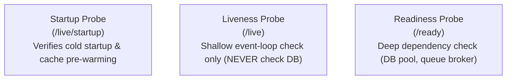

# Observability, Health Probes & Security Baseline

## 1. Single-Line Structured JSON Logging

All logs in production must be emitted as single-line JSON to `stdout`:

```json
{
  "timestamp": "2026-09-12T10:10:00.123Z",
  "level": "INFO",
  "service": "order-service",
  "correlationId": "018e3f2a-bc91-7890-a123-456789abcdef",
  "durationMs": 18,
  "http": {
    "method": "POST",
    "route": "/api/v1/orders",
    "statusCode": 201
  },
  "message": "Order placed successfully"
}
```

### Recursive PII Redaction
Passwords, JWTs, authorization headers, and payment card numbers MUST be replaced with `[REDACTED]` prior to serialization.

---

## 2. Kubernetes Tri-Probe Separation



- **Liveness Probe**: Verifies event-loop responsiveness. If DB is down, `/live` MUST still return 200 to prevent fleet-wide restart loops.
- **Readiness Probe**: Verifies critical dependencies. If DB is down, `/ready` returns 503 so traffic stops routing to this instance.

---

## 3. Stateless Authentication & Rotating Refresh Cookies

- **Access Token**: Short-lived (15 minutes), passed in `Authorization: Bearer <token>` header.
- **Refresh Token**: Long-lived (7 days), stored in `HttpOnly; Secure; SameSite=Strict` cookie.
- **Instant Revocation**: Store `token_version: Integer` on the user entity in the database and as a claim in the JWT. Incrementing `token_version` revokes all active sessions immediately.

---

## 4. Multi-Tenant Data Isolation (Row-Level Security)

```sql
-- PostgreSQL Row-Level Security Policy
ALTER TABLE orders ENABLE ROW LEVEL SECURITY;

CREATE POLICY tenant_isolation_policy ON orders
    FOR ALL
    USING (tenant_id = NULLIF(current_setting('app.current_tenant_id', true), '')::uuid);

-- Connection hook sets tenant context per request:
SET LOCAL app.current_tenant_id = '018e3f2a-bc91-7890-a123-456789abcdef';
```
