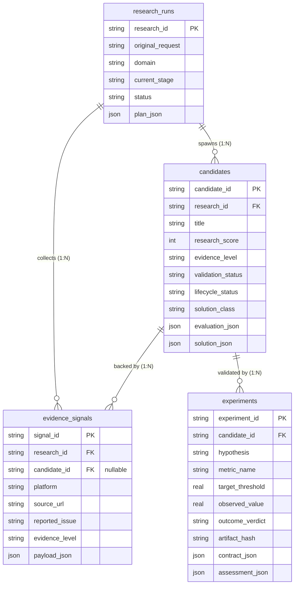

# Entity Relationships & Architecture Patterns Reference

## Purpose
This document specifies the relational hierarchy, foreign key constraints, and architectural design patterns governing the problem discovery persistence store.

---

## Entity Relationship Topology



---

## The Claim-Check Pattern (Hybrid Relational + JSON)

The database avoids two common extremes:
1. **Pure Relational Normalization**: Having 20 tables for every sub-score, dimension, and step would require complex migrations whenever scoring models evolve.
2. **Pure Document Store (NoSQL)**: Storing entire candidate states in JSON blobs prevents SQL-level filtering, aggregate counting, and indexing.

### The Hybrid Solution
- **Core Index Columns**: Fast, indexed relational columns (`research_score`, `evidence_level`, `validation_status`, `lifecycle_status`, `solution_class`) enable instant filtering and grouping.
- **Claim-Check JSON Payloads**: Deep nested data structures (14-node forensic maps, alternate competitor matrices, experiment verification logs, 15-flag constraint audits) are stored in validated JSON document columns (`evaluation_json`, `solution_json`, `contract_json`, `assessment_json`).

---

## Signal-to-Candidate Dynamic Linkage Protocol

1. **Stage 2 (Signal Collection)**:
   - Signals are collected during `evidence-research` under a specific `research_id`.
   - At this moment, candidates do NOT yet exist.
   - `evidence_signals.candidate_id` is initialized as `NULL`.
2. **Stage 3 (Problem Candidate Clustering)**:
   - `problem-evaluation` clusters multiple unlinked signals sharing an identical operational root cause into a candidate.
   - The candidate record is created in `candidates`.
   - The candidate updater performs an atomic bulk update:
     ```sql
     UPDATE evidence_signals
     SET candidate_id = :candidate_id
     WHERE signal_id IN (:supporting_signal_ids);
     ```
3. **Traceability Guarantee**:
   - Every candidate can trace its empirical pedigree back to authentic URLs and verbatim quotes via `SELECT * FROM evidence_signals WHERE candidate_id = :candidate_id`.

---

## Cascading & Deletion Policies

- `ON DELETE CASCADE` is intentionally omitted from the schema.
- Hard deletions are strictly barred by [discovery-state-rules.md](../rules/discovery-state-rules.md).
- Foreign key violations abort transactions immediately via `PRAGMA foreign_keys = ON;`.
