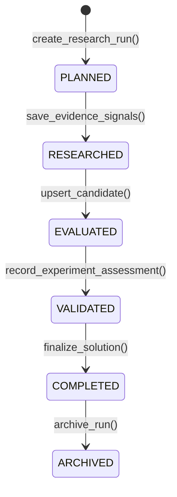
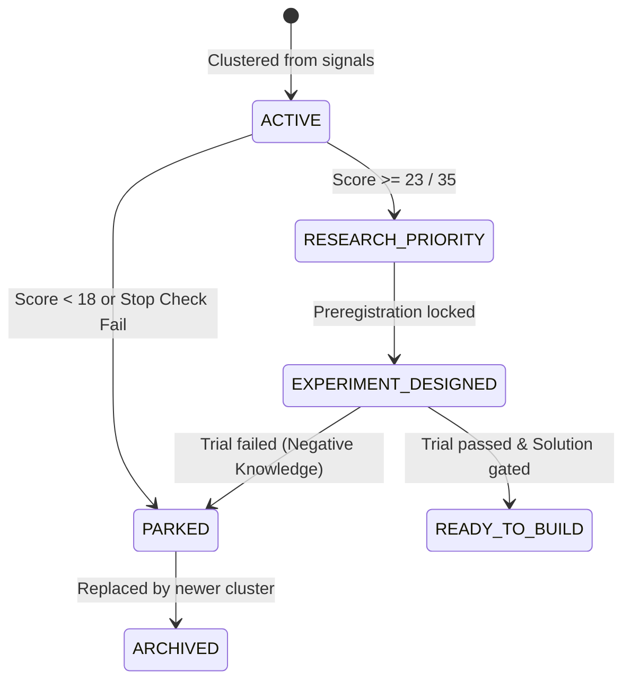
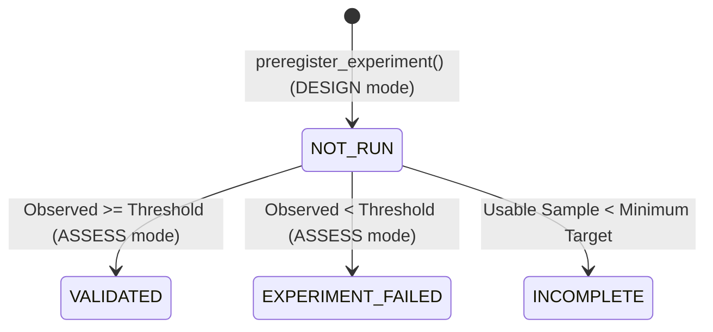

# Lifecycle Model & State Machine Reference

## Purpose
This document provides the authoritative finite state machine (FSM) specification governing the lifecycles of `research_runs`, `candidates`, and `experiments`.

---

## 1. Research Run Lifecycle (`research_runs`)

A research run represents the end-to-end investigation of a specific domain or user intent.

| State | Entering Action | Triggering Capability | Description |
|---|---|---|---|
| `PLANNED` | `create_research_run()` | `research-planning` | Research plan created with query streams and explicit unknowns. |
| `RESEARCHED` | `save_evidence_signals()` | `evidence-research` | Evidence signals collected from primary sources and saved. |
| `EVALUATED` | `upsert_candidate()` | `problem-evaluation` | Signals clustered into candidates, 14 nodes mapped, scored 0-35. |
| `VALIDATED` | `record_experiment_assessment()` | `experiment-validation` | Empirical trial executed and threshold verified. |
| `COMPLETED` | `finalize_solution()` | `solution-strategy` | Solution class assigned, STS formulated, lifecycle finalized. |
| `ARCHIVED` | `archive_run()` | Admin / Orchestrator | Exploration concluded and stored as historical reference. |

---

## 2. Candidate Lifecycle (`candidates`)

Candidates track individual problem hypotheses through rigorous empirical gates.

### Candidate Status Dimensions

A candidate's state is defined across two orthogonal dimensions:

#### 1. `lifecycle_status` (Operational Pipeline State)
- **`ACTIVE`**: Candidate newly created from signal cluster; currently being investigated.
- **`RESEARCH_PRIORITY`**: High research score ($\ge 23/35$) justifying real-world trial design.
- **`EXPERIMENT_DESIGNED`**: Preregistered experiment contract is active and awaiting trial results.
- **`PARKED`**: Candidate halted due to low score ($< 18$), non-software resolution, or failed experiment.
- **`READY_TO_BUILD`**: Passed empirical experiment and gated through solution strategy.
- **`ARCHIVED`**: Replaced or retired.

#### 2. `validation_status` (Empirical Truth State)
- **`UNVERIFIED`**: Default state. High research score indicates potential, NOT verified fact.
- **`VALIDATED`**: Preregistered trial observed value met or exceeded threshold with audited proof.
- **`EXPERIMENT_FAILED`**: Observed value failed threshold. Preserved as negative knowledge.

---

## 3. Experiment Lifecycle (`experiments`)

Experiments enforce strict preregistration before observation.

- **`NOT_RUN`**: Contract registered with immutable threshold, direction, metric, and sample size.
- **`VALIDATED`**: Observed data verified against threshold with valid SHA-256 digest and human audit.
- **`EXPERIMENT_FAILED`**: Threshold missed. Irreversible state.
- **`INCOMPLETE`**: Sample size fell short of `minimum_usable_sample`. Must be completed or restarted with a new ID.
