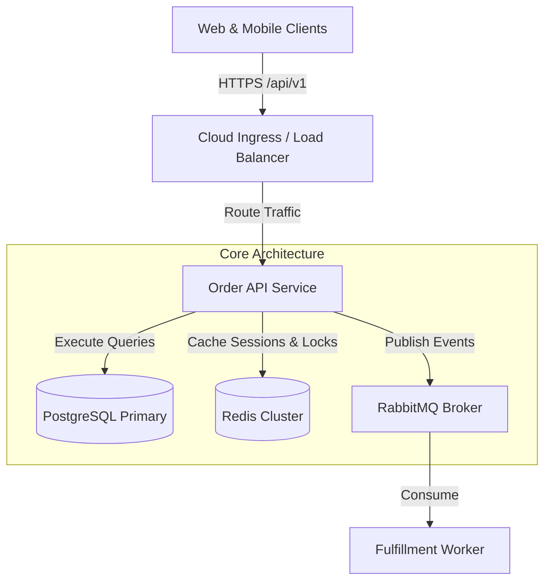

# Documentation Architecture & System Runbook Standards

## Description
Enforces exhaustive, maintainable, and developer-friendly documentation architecture across all software services, backend APIs, and microservices. Mandates that every repository provides a deterministic `< 5-minute` onboarding `README.md`, a standardized six-pillar `docs/` technical runbook hierarchy (`architecture.md`, `development.md`, `testing.md`, `deployment.md`, `database.md`, `troubleshooting.md`), version-controlled declarative system diagrams rendered via Mermaid.js, structured changelog maintenance (`CHANGELOG.md`), and actionable incident troubleshooting runbooks prior to production deployment.

## Constraints

### 1. Mandatory 5-Minute Developer Quick Start Invariant
- Every project repository MUST maintain a top-level `README.md` that enables a new developer with zero prior system context to boot and run the service locally in under 5 minutes.
- The `README.md` MUST include:
  1. **Single-Sentence Intent**: Clear description of the service's business domain and technical responsibilities.
  2. **Prerequisites Matrix**: Exact language runtime versions (e.g. Node.js 20+, Go 1.22+), Docker Compose, and package manager.
  3. **Deterministic Quick Start**: Exact CLI commands (`git clone`, `cp .env.example .env`, `docker compose up -d`, install, migrate, dev start).
  4. **Verification Step**: Exact endpoint curl or test command to verify healthy local execution.
- Multi-page tribal setup guides or unversioned wiki installation procedures are STRICTLY FORBIDDEN.

### 2. Six-Pillar `docs/` Runbook Hierarchy
- In addition to `README.md`, all repositories MUST maintain a structured `docs/` directory containing six dedicated runbooks:
  - **`docs/architecture.md`**: System topology, clean architecture layers, cross-service dependencies, and Architectural Decision Records (ADRs).
  - **`docs/development.md`**: Local developer workflows, environment variable configurations, debugging techniques, and standard CLI commands.
  - **`docs/testing.md`**: Testing pyramid breakdown (unit, integration, smoke, performance), coverage gates ($\ge 80\%/\ge 75\%$), and test data fixture seeding.
  - **`docs/deployment.md`**: CI/CD pipeline topology, environment promotion (dev $\rightarrow$ staging $\rightarrow$ prod), canary rollout strategies, and rollback runbooks.
  - **`docs/database.md`**: Entity-Relationship (ER) model, migration conventions, soft delete rules, connection pool sizing, and index guidelines.
  - **`docs/troubleshooting.md`**: Incident response playbooks, common error code catalog, log tracing queries, and database saturation mitigation.

### 3. Declarative Version-Controlled Mermaid Diagrams
- System architecture, sequence flows, state machines, and database entity relationships MUST be authored using declarative **Mermaid.js** syntax directly embedded in markdown files.
- Binary image files (`.png`, `.jpg`) or external unversioned diagram links (e.g. unexported Lucidchart/Figma links) are FORBIDDEN as primary documentation because they cannot be diffed, reviewed in pull requests, or kept in sync with code mutations.

### 4. Release Changelog Governance (`CHANGELOG.md`)
- Every service repository MUST maintain a root `CHANGELOG.md` following the [Keep a Changelog](https://keepachangelog.com/) standard.
- Changes MUST be grouped under standardized category headers:
  - `Added` (new user-facing features or endpoints).
  - `Changed` (modifications to existing functionality).
  - `Deprecated` (features slated for future removal).
  - `Removed` (deprecated features now removed).
  - `Fixed` (bug fixes).
  - `Security` (vulnerability patches).
- Releases MUST link to git commit tags or GitHub release comparison URLs.

### 5. Production Troubleshooting & Incident Playbooks
- The `docs/troubleshooting.md` runbook MUST be actionable for on-call engineers operating under high-stress incident conditions.
- Every documented incident playbook MUST include:
  1. **Symptom / Alert Name**: Exact Prometheus alert name or HTTP status pattern.
  2. **Root Cause Analysis**: Underlying failure mechanism (e.g. connection pool exhaustion, Redis OOM, deadlocks).
  3. **Immediate Mitigation Step**: Immediate recovery command (e.g. scale replica count, restart consumer, kill long-running query).
  4. **Investigation Queries**: Exact log search queries or SQL diagnostic commands.

### 6. Pre-Production Documentation Review Gate
- No service may be approved for initial production deployment without a verified, complete documentation suite.
- Pull requests introducing major architectural modifications (new database tables, external integrations, altered authentication flows) MUST update relevant `docs/` files within the same pull request.

## Examples

### 1. 5-Minute Developer Quick Start (`README.md`)
```markdown
# Order Processing Service
Processes customer checkout workflows, reserves inventory, and orchestrates payment settlement.

## Prerequisites
- Node.js >= 20.11.0 (LTS)
- pnpm >= 11.1.3
- Docker & Docker Compose v2

## Quick Start
```bash
# 1. Clone repository and initialize environment variables
git clone https://github.com/company/order-service.git && cd order-service
cp .env.example .env

# 2. Launch backing services (PostgreSQL & Redis)
docker compose up -d

# 3. Install dependencies and run database migrations
pnpm install --frozen-lockfile
pnpm run db:migrate

# 4. Start local development server
pnpm run dev
```

Verify service readiness:
```bash
curl -f http://localhost:3000/api/v1/health/ready
```
```

### 2. Declarative Mermaid Architecture Diagram (`docs/architecture.md`)
```markdown

```
