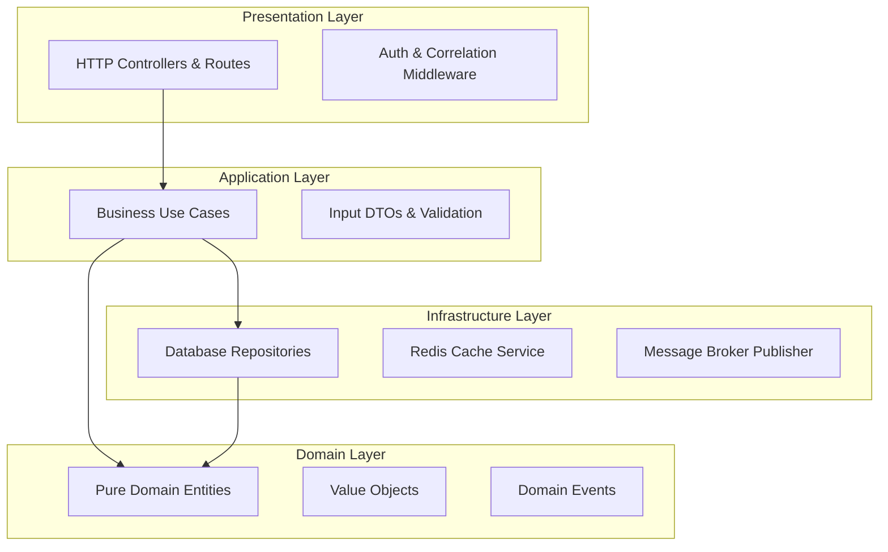
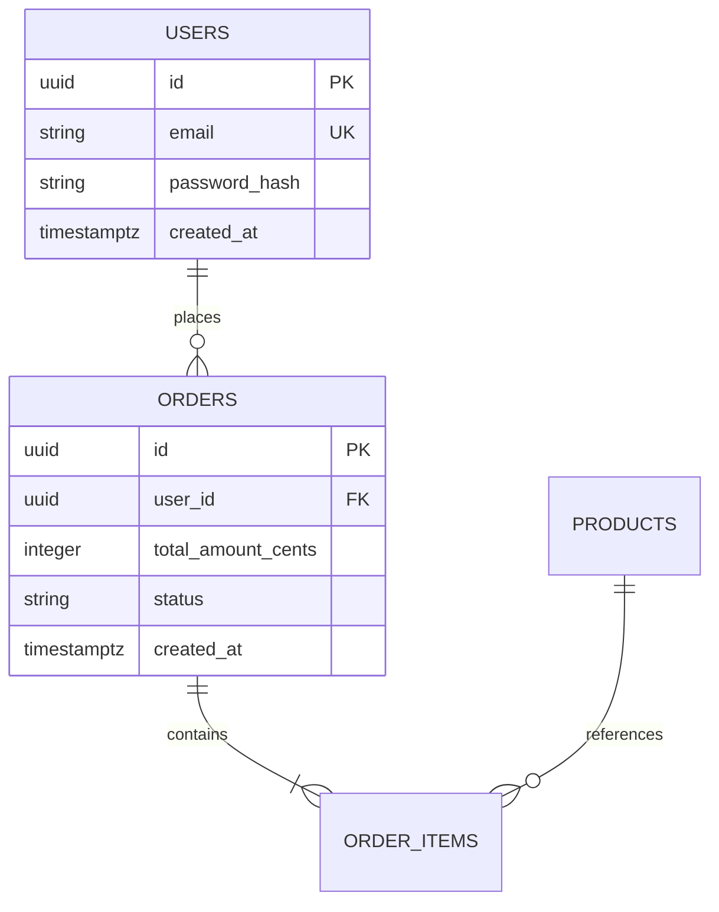

# System Documentation & Runbook Architecture Reference

## Overview
This reference establishes the engineering principles and structural blueprints for repository documentation. It details the **5-Minute Developer Quick Start Standard**, **Six-Pillar `docs/` Technical Runbook Hierarchy**, **Architectural Decision Records (ADRs)**, **Declarative Mermaid Diagramming**, and **Production Incident Troubleshooting Playbooks**.

---

## 1. The 5-Minute Quick Start Standard

### The Golden Rule of Developer Onboarding
A newly joined software engineer with zero tribal knowledge must be able to:
1. Clone the repository.
2. Boot all backing dependencies via Docker Compose.
3. Apply schema migrations and run the test suite.
4. Execute `pnpm run dev` and verify healthy HTTP response at `/health/ready`.
**All within 5 minutes of terminal execution.**

### Standard `README.md` Anatomy
```markdown
# Service Name

> Single-sentence executive summary of business purpose.

## 📋 Prerequisites
- Exact runtime version (Node.js >= 20.11 LTS, Python 3.12+, Go 1.22+)
- Docker & Docker Compose v2
- Package manager (pnpm >= 11.1.3)

## 🚀 Quick Start
Step 1: Clone and configure .env
Step 2: docker compose up -d
Step 3: pnpm install --frozen-lockfile
Step 4: pnpm run db:migrate
Step 5: pnpm run dev

## 🧪 Verification & Testing
curl http://localhost:3000/api/v1/health/ready
pnpm test

## 📚 Technical Documentation
- [Architecture](docs/architecture.md)
- [Local Development](docs/development.md)
- [Testing Standards](docs/testing.md)
- [Deployment & Operations](docs/deployment.md)
- [Database Schema & Migrations](docs/database.md)
- [Troubleshooting & Incident Playbooks](docs/troubleshooting.md)
```

---

## 2. The Six-Pillar `docs/` Hierarchy

Every production service maintains a dedicated `docs/` directory with 6 core files:

```
docs/
├── architecture.md      → System design, layer diagram, data flow, ADRs
├── development.md       → Local dev setup, debugging tips, useful CLI commands
├── testing.md           → Testing pyramid, coverage targets, fixture seeding
├── deployment.md        → Topology, CI/CD promotion, canary & rollback steps
├── database.md          → ER diagrams, migration conventions, index rules
└── troubleshooting.md   → Common errors, FAQs, on-call incident playbooks
```

### Pillar Breakdown

| Document | Primary Audience | Key Contents |
| :--- | :--- | :--- |
| `architecture.md` | Architects, Engineers | Clean architecture layers, external dependencies, Mermaid diagrams, ADRs. |
| `development.md` | Core Developers | Dev server scripts, environment flags, seed scripts, local debugging. |
| `testing.md` | QA, Developers | Unit vs integration vs e2e commands, Testcontainers setup, k6 SLA tests. |
| `deployment.md` | DevOps, SREs | Pipeline stages, Kubernetes deployment manifests, rollback commands. |
| `database.md` | DBA, Developers | Mermaid ER diagrams, migration procedures, index rules, pool configs. |
| `troubleshooting.md` | On-Call Engineers | Alert resolution runbooks, common 5xx root causes, DB saturation mitigation. |

---

## 3. Declarative Mermaid.js Diagramming

All diagrams must be written in declarative Mermaid markdown to ensure they are version-controlled, searchable, and diffable in pull requests.

### Clean Architecture Layer Diagram


### Database Entity-Relationship (ER) Diagram


---

## 4. Architectural Decision Records (ADRs)

Key architectural choices (e.g. choosing PostgreSQL over MongoDB, selecting Redis for distributed locks) must be recorded in `docs/architecture.md` or `docs/adr/`:

```markdown
### ADR-001: Selection of PostgreSQL with Testcontainers for Integration Testing
- **Status**: Accepted
- **Context**: Need high-concurrency ACID transactions, JSONB document querying, and exact dialect compatibility in automated test suites.
- **Decision**: Adopt PostgreSQL 16 as the primary datastore and Testcontainers for automated integration tests. In-memory SQLite mocking is strictly forbidden.
- **Consequences**: Fast, high-parity test runs with zero dialect discrepancies. Requires Docker daemon on local developer machines and CI runners.
```

---

## 5. Production Incident Playbook Architecture

When alerts trigger at 2:00 AM, `docs/troubleshooting.md` must provide immediate, high-signal remediation steps:

```markdown
### Incident: Database Connection Pool Saturation
- **Alert**: `PostgresConnectionPoolExhausted` (Active connections > 90% of pool max)
- **Symptoms**: HTTP requests timing out at 30 seconds; 503 Service Unavailable returned.
- **Immediate Mitigation**:
  1. Inspect active long-running queries:
     `SELECT pid, now() - query_start AS duration, query FROM pg_stat_activity WHERE state != 'idle' ORDER BY duration DESC LIMIT 5;`
  2. Terminate rogue query blocking connections:
     `SELECT pg_terminate_backend(pid);`
  3. Temporarily increase pool ceiling or restart unresponsive worker pods:
     `kubectl rollout restart deployment/order-service -n production`
- **Permanent Fix**: Add missing index or implement query timeout ceiling.
```
