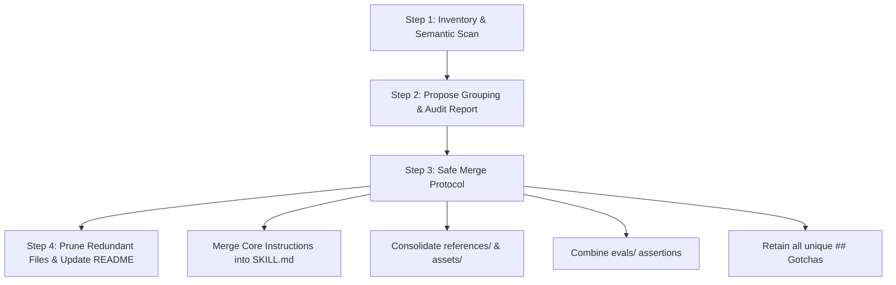

# Toolkit Merging & Deduplication Playbook

## 1. Overview
As an engineering team or open-source community adds agent context over time, knowledge fragmentation naturally occurs (e.g. multiple skills covering the same framework features, or rules duplicated across directories). 

`consolidate-agent-toolkit` is the systematic refactoring and deduplication engine that groups fragmented knowledge into cohesive, authoritative **5-Pillar Agent Skills** while guaranteeing **Zero Data Loss**.

---

## 2. The 4 Stages of Semantic Consolidation



### Stage 1: Inventory & Semantic Scan
- Discover all skills and rules across `frameworks/`, `infra/`, `shared/`, and `domains/`.
- **Protected Directory**: NEVER audit, merge, or delete files inside `shared/generators/`. This is the toolkit's internal factory.
- Identify semantic clusters (e.g. `angular-forms`, `angular-reactive-forms`, `angular-typed-forms`).

### Stage 2: Propose Grouping & Review
Before making any filesystem modifications, generate a structured consolidation proposal:
- Identify the **Master Target Bundle** (the most comprehensive or standard-compliant bundle).
- Enumerate the **Secondary Source Bundles** scheduled for absorption.
- List distinct knowledge items to preserve (Gotchas, CLI tools, unique templates).

### Stage 3: The Zero-Loss Merge Protocol
When absorbing a secondary skill into a master bundle:
1. **Core Instructions (`SKILL.md`)**:
   - Merge procedural steps.
   - Combine personas and protocols.
   - Enforce the **< 500 lines** ceiling.
2. **Authoritative References (`references/`)**:
   - Relocate detailed API specs or guides into `references/`.
   - Update relative links in `SKILL.md`.
3. **Execution Scripts (`scripts/`)**:
   - Move standalone CLI scripts into the master `scripts/` directory.
   - Ensure scripts follow the PEP 723 standard.
4. **Starter Assets (`assets/`)**:
   - Merge JSON schemas, templates, and boilerplates into `assets/`.
5. **Empirical Evals (`evals/`)**:
   - Combine test cases from both `evals/evals.json` suites.
   - Ensure all unique assertions are preserved and re-numbered.
6. **Mandatory Gotchas Accumulation**:
   - Append all distinct Gotchas and edge cases from both skills under `## Gotchas`.

### Stage 4: Safe Pruning & Validation
1. Verify that all unique content has been successfully migrated to the master bundle.
2. Remove the empty or redundant secondary directory.
3. Run automated validation:
   ```bash
   python3 shared/generators/skills/generate-skill/scripts/validate_skill.py <master-skill-path>
   python3 shared/generators/skills/eval-skill/scripts/run_evals.py <master-skill-path> --save-grading
   ```
4. Sync the updated clean context to `.agents/` and `~/.gemini/`.

---

## 3. Rules Consolidation Guidelines
- When merging two overlapping `.md` rules:
  - Consolidate common constraints.
  - Choose the optimal trigger (`model_decision` or `glob`).
  - Target 6,000–8,000 characters (hard ceiling of 12,000 characters).
  - Validate with `validate_rule.py`.
