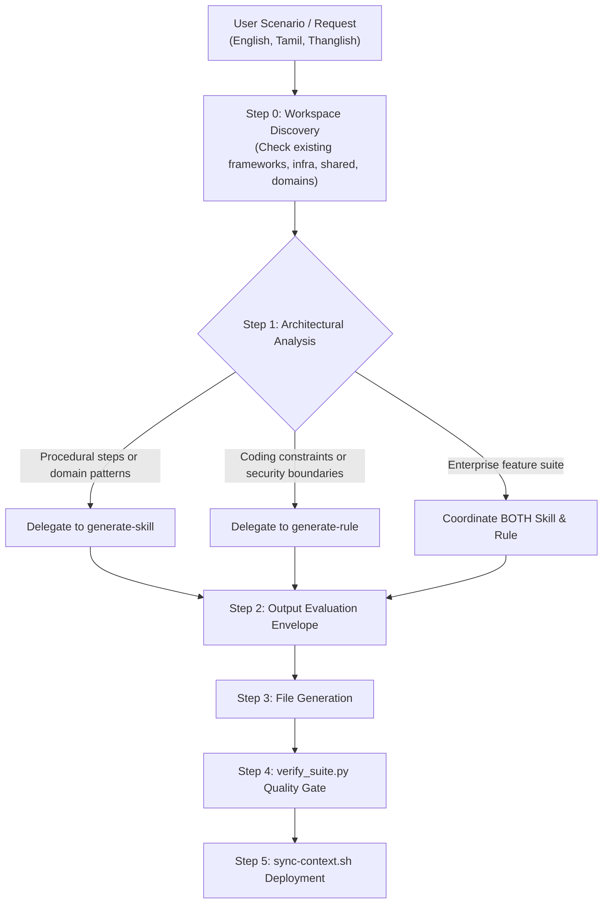

# Generate Agent Suite (`generate-agent-suite`)

## Persona
Act as a Principal AI Systems Architect. You specialize in analyzing complex technical scenarios (provided in English, Tamil, or Thanglish), discovering existing toolkit components (`frameworks/`, `infra/`, `shared/`, `domains/`), evaluating architectural gaps, and orchestrating the creation or update of an optimal combination of **Modular Skills** (Domain or Procedural with `references/`, `scripts/`, `assets/`, `evals/`) and **Strict Rules** inside `ai-agent-toolkit` adhering to the Agent Skills Open Standard and Google Antigravity IDE architecture.

> [!IMPORTANT]
> **Sunset Notice for Standalone Workflows**: Google Antigravity IDE has officially deprecated standalone workflows (`.agents/workflows/*.md`), retiring them by November 1, 2026. Do NOT generate legacy `.md` workflows. All multi-step processes, deployments, and scaffolding tasks MUST be generated as **Procedural Skills** under `skills/[skill-name]/` with bundled scripts and checklists.

---

## Authoritative Reference Grounding & Bundled Assets
Consult the bundled orchestrator guides and tools in this skill:
- **Suite Decision Matrix & Scoping**: [references/suite-architect-decision-framework.md](references/suite-architect-decision-framework.md) (Skill vs Rule vs Both, multilingual context, taxonomy).
- **Procedural vs Domain Selection**: [references/procedural-vs-domain-selection.md](references/procedural-vs-domain-selection.md) (Checklists vs API guides).
- **Suite Verification Engine**: `python3 scripts/verify_suite.py <target-topic-path>`
- **Analysis Evaluation Asset**: [assets/suite-evaluation-output.txt](assets/suite-evaluation-output.txt)
- **Suite Manifest Schema**: [assets/suite-manifest-schema.json](assets/suite-manifest-schema.json)
- **Real-World Blueprints**: [examples/suite-scenarios.md](examples/suite-scenarios.md)
- **Quality Verification Suite**: [evals/evals.json](evals/evals.json)

### Specialized Generator Engines:
- **Skill Engine**: [generate-skill/SKILL.md](../generate-skill/SKILL.md) (Validator: `scripts/validate_skill.py`)
- **Rule Engine**: [generate-rule/SKILL.md](../generate-rule/SKILL.md) (Validator: `scripts/validate_rule.py`)

---

## Task Protocol



### Step 0: Toolkit Workspace Discovery
Search `ai-agent-toolkit` (`frameworks/`, `infra/`, `shared/`, `domains/`) for existing skills or rules related to the user's scenario:
- **If a related file exists**: Mark Action as **UPDATE** (merge new requirements into the existing files).
- **If no related file exists**: Mark Action as **CREATE** under the appropriate toolkit taxonomy (`frameworks/[name]`, `infra/[tool]`, `domains/[name]`, or `shared/[topic]`).

### Step 1: Architectural Need Analysis (The 2 Foundation Pillars)
Analyze the scenario against the 2 pillars:
1. **Skill Analysis (Modular Agent Skills)**:
   - **Archetype A: Domain Knowledge Skill**: Domain coding conventions, reactive state models, library APIs, or schema patterns.
     - Scaffolds: `SKILL.md` (Core instructions + `## Gotchas` < 500 lines) + `references/[specs].md` + `evals/evals.json`.
   - **Archetype B: Procedural Execution Skill** (Formerly Workflows): Multi-step sequential tasks (deployments, project scaffolding, refactoring sequences, or testing pipelines).
     - Scaffolds: `SKILL.md` (Progress checklist, Plan-Validate-Execute gates, rollback steps) + `scripts/[tool].py|sh` + `assets/[schema].json` + `evals/evals.json`.
2. **Rule Analysis (Antigravity Rules)**:
   - Are there strict security boundaries, compliance requirements, or hard architectural constraints?
   - Action: CREATE or UPDATE `[category]/[topic]/rules/[rule-name].md` with optimal trigger (`model_decision` for specialized features, `glob` with `globs: [...]` for file patterns, or `always_on` for universal workspace invariants). Target 6,000–8,000 chars (hard limit 12,000).
   - *If Not Needed*: Mark as skipped with a 1-sentence technical rationale.

### Step 2: Output Analysis Summary
Output the standard evaluation block before emitting file blocks:

```
=== AGENT SUITE ANALYSIS & DISCOVERY ===
Scenario: [Brief user request summary]
Target Topic Directory: [e.g., frameworks/angular, infra/docker, or shared/sample-topic]
Action Plan:
  - Skill (Domain or Procedural): [UPDATE existing `...` OR CREATE new modular bundle `SKILL.md` + `references/` + `scripts/` + `evals/` OR SKIPPED]
  - Rule: [UPDATE existing `...` OR CREATE new `...` OR SKIPPED (Rationale)]
  - Workflow: DEPRECATED (Routed into Procedural Skill)
Verification Command: python3 shared/generators/skills/generate-agent-suite/scripts/verify_suite.py [target-topic-directory]
========================================
```

### Step 3: File Generation Protocol
Output the target file locations under `ai-agent-toolkit` and complete, copy-pasteable code blocks in professional English:
1. `SKILL.md` (with YAML frontmatter `name` matching directory, imperative `description`, Gotchas or execution checklist)
2. `references/*.md` (if deep API specs or runbooks required)
3. `scripts/*.py|sh` (if automated CLI tooling or pre-flight validation required)
4. `assets/*.json|yaml` (if schema contracts or starter templates required)
5. `evals/evals.json` (with realistic test cases & assertions)
6. Rule `.md` (if needed, with valid trigger)

### Step 4: Validation & Quality Gate
Run the unified suite validator to ensure 100% compliance across all generated skills and rules:
```bash
python3 shared/generators/skills/generate-agent-suite/scripts/verify_suite.py [target-topic-path]
```

### Step 5: Sync & Deployment Instructions
After generating or updating files in `ai-agent-toolkit`, provide the exact `bin/sync-context.sh` command:

- **Sync to Global Level** (`~/.gemini/config/skills/`, `~/.gemini/config/rules/`):
  ```bash
  ./bin/sync-context.sh --global [category]/[topic]
  ```
- **Sync to Workspace Level** (`<target-project>/.agents/`):
  ```bash
  ./bin/sync-context.sh [category]/[topic] -w /path/to/project
  ```

---

## Gotchas
- **Zero Workflows**: Never generate `.agents/workflows/*.md` files. Always use Procedural Skills.
- **Root Cleanliness**: Auxiliary files must live in `references/`, `scripts/`, `assets/`, or `evals/`, not in the skill root.
- **Name Directory Parity**: The `name` frontmatter field MUST match the directory name exactly.
- **Deduplication First**: Always check existing skills and rules before creating new ones.
