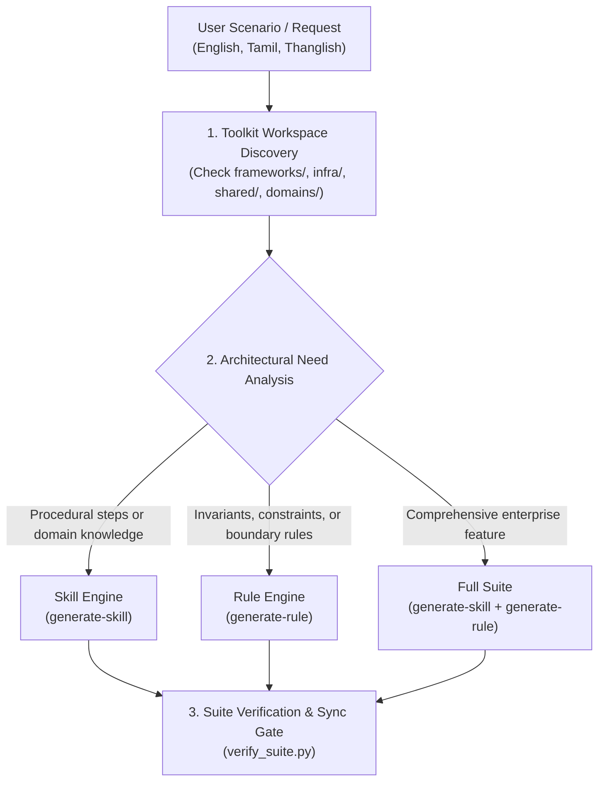

# Suite Architect Decision Framework & Domain Scoping Rubric

## 1. Overview
The `generate-agent-suite` skill is the **Master Orchestrator** in `ai-agent-toolkit`. It serves as the primary intelligence layer that ingests user requests (in English, Tamil, or Thanglish), analyzes technical context, determines whether the request requires an **Agent Skill**, an **Antigravity Rule**, or **Both**, and coordinates the execution using the specialized generator engines.



---

## 2. Decision Matrix: Skill vs Rule vs Both

| Identified Requirement | Component Decision | Concrete Archetype & Scope | Delegation Engine |
| :--- | :--- | :--- | :--- |
| Multi-step execution, deployment pipelines, project scaffolding, automated testing runs, or migrations | **Procedural Skill** | Procedural Execution Skill (`SKILL.md` with checklist, `scripts/`, `assets/`, `evals/`) | [`generate-skill`](../../generate-skill/SKILL.md) |
| Deep API references, reactive state patterns, library schemas, conventions, and Gotchas | **Domain Skill** | Domain Knowledge Skill (`SKILL.md` < 500 lines, `references/*.md`, `evals/`) | [`generate-skill`](../../generate-skill/SKILL.md) |
| Coding standards, security mandates, prohibition of anti-patterns, zero `any` types, or glob triggers | **Antigravity Rule** | Rule `.md` with `trigger: model_decision` or `trigger: glob`, 6k–8k chars, MUST/MUST NOT | [`generate-rule`](../../generate-rule/SKILL.md) |
| Complete enterprise feature (e.g., Redis Caching, CivicPath GIS, Double-Entry Finance, Auth Suite) | **Both (Full Suite)** | Scaffolds **1 or more Skills** (procedures/API) + **1 or more Rules** (constraints/invariants) | Coordinates **Both** |

---

## 3. Toolkit Directory Taxonomy

When scaffolding or upserting components, place files in the authoritative directory tree:

```text
ai-agent-toolkit/
├── frameworks/        # Technology frameworks (angular, nestjs, nextjs, react, express)
│   └── [framework]/
│       ├── skills/    # Framework-specific skills
│       └── rules/     # Framework-specific rules
├── infra/             # Infrastructure & platform tools (docker, kubernetes, redis, postgres)
│   └── [tool]/
│       ├── skills/
│       └── rules/
├── domains/           # Specific business products (nidhiflow, civicpath, seyalicraft)
│   └── [product]/
│       ├── skills/
│       └── rules/
└── shared/            # Cross-cutting concerns (generators, clean-code, devsecops, git)
    └── [concern]/
        ├── skills/
        └── rules/
```

---

## 4. Ingesting Informal & Multilingual Context (Tamil & Thanglish)

Developers often express requirements informally or in Thanglish. The orchestrator must extract concrete technical requirements:

### Example 1: Thanglish Request
- **User Prompt**: `"NestJS la redis cache module create pannanum bro, cache hit miss console la log aaganum, mutation aana cache clear aaganum."`
- **Architectural Extraction**:
  1. **Technology**: NestJS, Redis, Cache-Manager.
  2. **Skill Need**: Procedural setup and module authoring (CacheModule, Interceptor, Service).
  3. **Rule Need**: Architectural invariant (Zero un-invalidated mutations, mandatory TTL, no caching of sensitive auth endpoints).
  4. **Action**: Scaffold `infra/redis/skills/caching-strategies/` + `infra/redis/rules/caching-invariants.md`.

### Example 2: Procedural Migration Request
- **User Prompt**: `"Cloudflare Pages la Angular SPA deploy panna pipeline venum."`
- **Architectural Extraction**:
  1. **Technology**: Angular (CSR SPA), Cloudflare Pages, Wrangler CLI.
  2. **Skill Need**: Procedural Execution Skill (`deploy-angular-spa-cloudflare`) with progress checklist, pre-flight checks, and rollback instructions.
  3. **Rule Need**: None needed (rationale: purely sequential pipeline).
  4. **Action**: Scaffold `frameworks/angular/skills/cloudflare-angular-spa-deployment/`.

---

## 5. Smart Upsert vs Create Protocol

Before creating any file:
1. **Search Existing Paths**:
   ```bash
   find frameworks/ infra/ shared/ domains/ -name "*[keyword]*"
   ```
2. **Evaluate Semantic Overlap**:
   - If an existing skill/rule covers >70% of the topic: **UPDATE** (merge new procedures, edge cases, and Gotchas).
   - If no existing skill/rule matches: **CREATE** the new bundle under the appropriate taxonomy.
3. **Zero Duplication Guarantee**: Never create `angular-signals` if `angular-signal-state-management` already exists.
