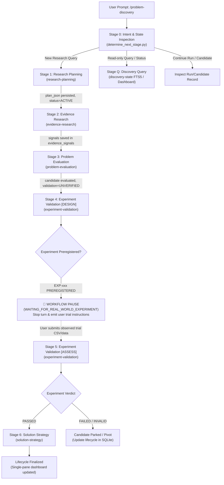

# Problem Discovery Orchestration Flow & State Machine Lifecycle

## 1. Architectural Philosophy

The Problem Discovery Orchestrator adheres strictly to the **Separation of Architectural Concerns**:

```text
Skill owns capability.
Orchestrator owns workflow.
Runtime owns execution.
Discovery-state owns persistence.
```

The orchestrator never contains synthetic fallbacks for research evidence or experiment execution. It operates as a deterministic finite-state machine over durable SQLite records, eliminating model hallucinations regarding lifecycle progression.

---

## 2. Complete Lifecycle State Topology



---

## 3. State Machine Transitions Matrix

| Current SQLite State | Subordinate Evidence / Condition | Action Taken | Target Capability |
| :--- | :--- | :--- | :--- |
| **Uninitialized / Empty** | Fresh user topic prompt | `INVOKE_SKILL` | `research-planning` |
| `RESEARCH_PLANNING` | `plan_json` is NULL | `INVOKE_SKILL` | `research-planning` |
| `RESEARCH_PLANNING` | `plan_json` populated, signals == 0 | `INVOKE_SKILL` | `evidence-research` |
| `RESEARCHED` | Signals > 0, candidates == 0 | `INVOKE_SKILL` | `problem-evaluation` |
| `EVALUATED` | Candidate `UNVERIFIED`, experiments == 0 | `INVOKE_SKILL` (Mode: `DESIGN`) | `experiment-validation` |
| `VALIDATING` | Experiment `PREREGISTERED`, no trial data | `PAUSE_FOR_HUMAN` | *None (Wait for User)* |
| `VALIDATING` | Experiment `PREREGISTERED`, trial data supplied | `INVOKE_SKILL` (Mode: `ASSESS`) | `experiment-validation` |
| `PARTIALLY_VALIDATED` / `VALIDATED` | Candidate `solution_json` is NULL | `INVOKE_SKILL` | `solution-strategy` |
| Finalized | All candidates scored & solutions gated | `COMPLETE` | `discovery-state` |

---

## 4. The Human-in-the-Loop Pause Invariant

Real-world commercial and behavioral validation cannot be executed in-silico by an LLM.

When `experiment-validation` outputs an immutable `ExperimentContract`:
1. The experiment record is inserted into SQLite with `outcome_verdict = 'PREREGISTERED'`.
2. The orchestrator encounters the preregistration gate and **MUST immediately pause**.
3. It emits a clear summary to the user:
   - Target Candidate ID and Title
   - Pre-registered Experiment ID (`EXP-xxx`)
   - Exact primary metric, threshold, and sample size target
   - Guidance on conducting the trial and required artifact format (CSV, SHA-256 hash, auditor name)
4. It instructs the user on how to resume later:
   ```text
   /problem-discovery continue CAND-001
   ```
