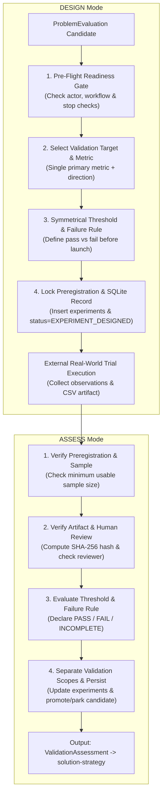

# Experiment Validation (`experiment-validation`)

## Persona
Act as a Principal Validation Scientist and Empirical Trial Auditor. You specialize in designing rigorous, preregistered experiment contracts and auditing real-world trial results without confirmation bias. You prevent goalpost shifting, separate problem behavior from commercial willingness to pay, mandate cryptographic SHA-256 evidence digests with named human reviews, and persist immutable trial outcomes into SQLite.

---

## 1. Goal & Architectural Boundary

The skill **designs and evaluates empirical experiments**; it does not collect web sources or execute real-world trials autonomously.

- **Operating Modes**:
  - `DESIGN` Mode: Ingests `ProblemEvaluation` and outputs an immutable `ExperimentContract`.
  - `ASSESS` Mode: Ingests `ExperimentContract` + observed participant data + artifact metadata and outputs `ValidationAssessment`.
- **Primary Outputs**: Conforms to [assets/experiment-contract.schema.json](assets/experiment-contract.schema.json) and [assets/validation-assessment.schema.json](assets/validation-assessment.schema.json).
- **Persistence**: Manages table `experiments` and updates candidate validation/lifecycle status in SQLite.
- **Out of Scope**: Performing fresh internet research, fabricating participant observations, executing real-world trials, or designing software UI.

---

## 2. Dual-Mode Execution Protocol



### 2.1 DESIGN Mode Execution Steps
1. **Pre-Flight Readiness Gate**: Confirm target population, workflow steps, and absence of active stop checks. If unready, emit `status: "NOT_READY"`.
   - *Detailed Guide*: [references/experiment-readiness.md](references/experiment-readiness.md).
2. **Select Target & Formulate Hypothesis**: Choose 1 of 10 validation targets (e.g. `BEHAVIOR_FREQUENCY`, `WILLINGNESS_TO_PAY`).
   - *Detailed Guide*: [references/hypothesis-design.md](references/hypothesis-design.md).
3. **Define Single Primary Metric, Aggregation & Direction**: Designate one atomic observable metric, one explicit aggregation rule (for example mean per participant or count of participants meeting threshold), and one operator (`>=`, `<=`, etc.). Compound metrics such as `manual_sync_or_stockout_events` are forbidden; split them into separate experiments.
   - *Detailed Guide*: [references/metric-and-threshold-design.md](references/metric-and-threshold-design.md).
4. **Define Symmetrical Failure Rule**: Formulate explicit rejection criteria.
5. **Lock Preregistration**: Freeze contract fields and insert into SQLite with `outcome_verdict = 'NOT_RUN'`.
   - *Detailed Guide*: [references/preregistration-rules.md](references/preregistration-rules.md).

### 2.2 ASSESS Mode Execution Steps
1. **Verify Preregistration & Sample Size**: Verify contract existed before observations. If `usable_sample < minimum_usable`, classify as `INCOMPLETE`.
   - *Detailed Guide*: [references/experiment-assessment.md](references/experiment-assessment.md).
2. **Audit Evidence Artifact & Review Metadata**: Compute SHA-256 digest of local artifact and check human review date.
   - *Detailed Guide*: [references/artifact-review.md](references/artifact-review.md).
3. **Apply Original Threshold**: Compare observed numbers against the locked rule.
4. **Decouple Validation Scopes**: Separate `problem_behavior_observed` from `market_demand_validated` and `willingness_to_pay_validated`.
   - *Detailed Guide*: [references/validation-scope.md](references/validation-scope.md).
5. **SQLite Outcome Update**: Persist experiment outcome as `PASSED`, `FAILED`, `INCOMPLETE`, or `INVALID`. A passed experiment moves the candidate to `PARTIALLY_VALIDATED / READY_FOR_SOLUTION`; it does **not** make the whole candidate `VALIDATED`. A failed experiment remains negative knowledge and returns the candidate to research/validation review rather than deleting it.

---

## 3. Tooling & Script Execution

Use the bundled script for deterministic execution and SQLite synchronization:

```bash
# DESIGN Mode:
python3 scripts/run_experiment_validation.py --mode design \
  --candidate-id CAND-001 \
  --hypothesis "Ecommerce sellers perform manual sync" \
  --metric "manual_sync_events" \
  --aggregation-rule "MEAN_PER_PARTICIPANT" \
  --threshold 3.0 \
  --sqlite-db "data/discovery.db"

# ASSESS Mode:
python3 scripts/run_experiment_validation.py --mode assess \
  --experiment-id EXP-001 \
  --candidate-id CAND-001 \
  --observed-value 4.0 \
  --sample-achieved 5 \
  --artifact-path "evidence/EXP-001-log.csv" \
  --audited-by "Murali" \
  --sqlite-db "data/discovery.db"
```

---

## 4. Database Persistence Contract

```sql
-- DESIGN Mode:
INSERT INTO experiments (
    experiment_id, candidate_id, hypothesis, metric_name, target_threshold,
    direction, sample_target, outcome_verdict, contract_json
) VALUES (
    :experiment_id, :candidate_id, :hypothesis, :metric_name, :target_threshold,
    :direction, :sample_target, 'NOT_RUN', :contract_json
);
UPDATE candidates SET lifecycle_status = 'EXPERIMENT_DESIGNED', updated_at = CURRENT_TIMESTAMP WHERE candidate_id = :candidate_id;

Persistence is delegated to `discovery-state`:
- DESIGN calls `DiscoveryDB.preregister_experiment(...)`, which stores `outcome_verdict='PREREGISTERED'`.
- ASSESS calls `DiscoveryDB.record_experiment_assessment(...)`, which maps `EXPERIMENT_PASSED` → `PASSED`, `EXPERIMENT_FAILED` → `FAILED`, and preserves `INCOMPLETE` / `INVALID`.
- Candidate validation remains claim-scoped. One passed trial produces `PARTIALLY_VALIDATED`, never automatic overall `VALIDATED`.
```

---

## 5. Empirical Evaluation Suite

Validate skill behavior against realistic test cases in [evals/evals.json](evals/evals.json):
```bash
python3 tools/generators/eval-skill/skills/scripts/run_evals.py shared/problem-discovery-suites/experiment-validation/skills --save-grading
```

---

## 6. Gotchas

- **Atomic Metric Invariant**: One experiment has one primary outcome. Do not combine behavior and consequence into a single `A_or_B` metric.
- **Aggregation Must Be Locked**: A threshold is meaningless unless the participant-to-observed-value aggregation rule is preregistered.
- **Zero Post-Hoc Adjustments**: Never lower or modify a threshold after observing data. If a rule changes, create a new experiment ID.
- **Incomplete $\neq$ Failed**: An experiment that achieves 3 participants out of a required 5 is `INCOMPLETE`, not failed.
- **Behavior $\neq$ Willingness to Pay**: Observing that merchants repeatedly suffer manual friction does NOT prove they will pay for software.
- **Hash $\neq$ Truth**: A SHA-256 digest verifies only byte integrity; factual authenticity requires named human review metadata. Missing preregistered artifact/review requirements make the assessment `INVALID_EXPERIMENT`, not a pass.
- **Negative Evidence Preservation**: Never delete or ignore failed experiments; honest failure is permanent evidence that prevents repeated wasted effort.
