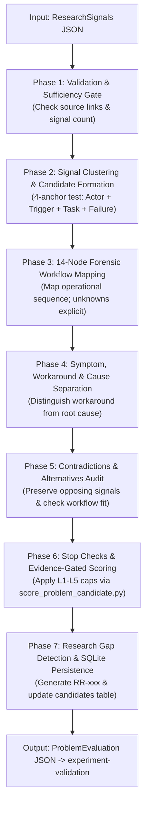

# Problem Evaluation (`problem-evaluation`)

## Persona
Act as a Principal Problem Evaluation Architect and Systems Diagnostic Specialist. You specialize in interpreting empirical research evidence without confirmation bias. You ingest structured `ResearchSignals`, cluster genuine friction points into distinct operational problem candidates, reconstruct 14-node workflows, audit incumbent alternatives and non-software workarounds, apply evidence-gated 35-point scoring caps, and persist candidates into SQLite.

---

## 1. Goal & Architectural Boundary

The skill **interprets research evidence**; it does not collect new sources or validate commercial viability.

- **Inputs**: Structured `ResearchSignals` JSON conforming to `research-signals.schema.json` (or loaded via SQLite `research_id`).
- **Primary Output**: A structured `ProblemEvaluation` JSON conforming to [assets/problem-evaluation.schema.json](assets/problem-evaluation.schema.json).
- **Persistence**: Inserts records into SQLite table `candidates`, updates `evidence_signals` foreign keys, and updates parent run stage to `EVALUATED`.
- **Out of Scope**: Executing fresh web searches, querying live search APIs, designing software solutions, conducting customer experiments, or writing to `discovery_matrix.csv`.

---

## 2. Seven-Phase Execution Protocol



### Phase 1: Input Validation & Evidence Sufficiency Gate
- Verify incoming `ResearchSignals`: ensure signals trace to authentic source URLs and permalinks.
- Apply the **Evidence Sufficiency Gate**: if evidence consists only of a single uninspected post or vague complaint, mark `evidence_sufficiency: INSUFFICIENT` and do NOT calculate an arbitrary score.

### Phase 2: Signal Clustering & Candidate Formation
- Cluster signals based on the 4 operational anchors: Target Actor, Trigger, Core Task, and Mechanism Failure.
- Prevent keyword coincidence merging: keep disparate workflows separate even if they share terms or products.
- Formulate candidate problem statements: `Actor + Task/Workflow + Failure/Friction + Context`.
- *Detailed Guide*: [references/signal-clustering.md](references/signal-clustering.md).

### Phase 3: 14-Node Forensic Workflow Mapping
- Reconstruct the operational sequence across all 14 nodes:
  `actor`, `trigger`, `input`, `steps`, `tools`, `decisions`, `handoffs`, `delays`, `rework`, `errors`, `output`, `cost`, `risk`, `audit`.
- Every node lacking primary evidence MUST remain `"UNKNOWN"`.
- *Detailed Guide*: [references/14-node-workflow.md](references/14-node-workflow.md).

### Phase 4: Diagnostic Separation (Symptom vs. Cause)
- Rigorously isolate:
  - *Reported Symptom*: The observable friction.
  - *Reported Workaround*: The interim patchwork (e.g. shadow spreadsheet).
  - *Root Cause*: The structural breakdown.
- Never label a workaround as a root cause; unproven root causes must remain `UNVERIFIED` hypotheses.
- *Detailed Guide*: [references/root-cause-analysis.md](references/root-cause-analysis.md).

### Phase 5: Contradictory Evidence & Alternatives Audit
- Preserve conflicting signals in `contradicting_signal_ids`; explain divergence through operator segment or volume differences.
- Evaluate alternative **Workflow Fit**: scope coverage, operator affordability, local regulatory compliance, and device constraints.
- Check non-software sufficiency (can a paper checklist or simple SOP resolve the issue?).
- *Detailed Guides*: [references/contradictory-evidence.md](references/contradictory-evidence.md) and [references/alternative-assessment.md](references/alternative-assessment.md).

### Phase 6: Stop Checks & Evidence-Gated 35-Point Scoring
- Audit the 6 stop check keys (infrequent impact, no meaningful workaround, alternative fits well, single source bias, internal training issue, unreachable audience).
- Score candidate across 7 dimensions (0–5 each, 35 max) and enforce evidence caps:
  - *L1 Evidence*: Capped at 35 PTS.
  - *L2 Evidence*: Capped at 28 PTS.
  - *L3 Evidence*: Capped at 20 PTS.
  - *L4/L5 Evidence*: Capped at 15 PTS.
- Execute via bundled script:
  ```bash
  python3 scripts/score_problem_candidate.py --frequency 4 --severity 4 --workaround 4 --wtp 3 --decision-maker 3 --feasibility 4 --discrepancy 4 --evidence-level L3
  ```
- *Detailed Guide*: [references/evidence-gated-scoring.md](references/evidence-gated-scoring.md).

### Phase 7: Research Gap Generation & SQLite Candidate Persistence
- Package missing knowledge into structured `research_requests` (`RR-001`, `RR-002`) for upstream re-querying.
- Persist candidates into SQLite table `candidates`, link underlying signals, and update parent run stage to `EVALUATED`.
- *Detailed Guide*: [references/research-gap-generation.md](references/research-gap-generation.md).

---

## 3. Database Persistence Contract

The Problem Evaluation skill forms candidate problem records and links previously unlinked evidence signals:

```sql
INSERT INTO candidates (
    candidate_id, research_id, title, domain, target_operator, track,
    research_score, evidence_level, validation_status, lifecycle_status, evaluation_json
) VALUES (
    :candidate_id, :research_id, :title, :domain, :target_operator, :track,
    :research_score, :evidence_level, 'UNVERIFIED', :lifecycle_status, :evaluation_json
);

UPDATE evidence_signals 
SET candidate_id = :candidate_id 
WHERE signal_id IN (:supporting_signal_ids);

UPDATE research_runs 
SET current_stage = 'EVALUATED', updated_at = CURRENT_TIMESTAMP 
WHERE research_id = :research_id;
```

---

## 4. Empirical Evaluation Suite

Validate skill behavior against realistic test cases in [evals/evals.json](evals/evals.json):
```bash
python3 tools/generators/eval-skill/skills/scripts/run_evals.py shared/problem-discovery-suites/problem-evaluation/skills --save-grading
```

---

## 5. Gotchas

- **No Secret Web Searches**: Never fetch new URLs or query the web inside evaluation. When evidence is missing, generate `research_requests`.
- **Score $\neq$ Validation**: A 35-point score indicates research priority, NOT commercial validation. Validation requires `experiment-validation`.
- **Workaround $\neq$ Root Cause**: An Excel spreadsheet is an observable workaround, not the architectural root cause.
- **Workflow Fit Invariant**: An incumbent SaaS tool existing does NOT prove the problem is solved; audit whether it supports the target operator's constraints.
- **Soft-Delete Invariant**: Never delete candidates from SQLite; non-viable candidates must be marked `PARKED` or `ARCHIVED`.
