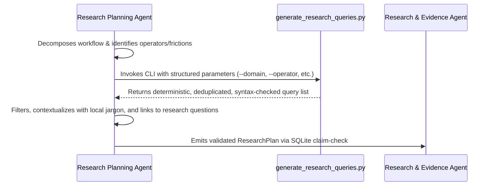

# Search Strategy & Query Generation Specification

## Overview
Defines the Atomic Search Unit methodology and maps search queries across 5 distinct search-source categories to uncover authentic operational friction.

---

## 1. The Atomic Search Unit Standard
Every precision search query must be constructed from four fundamental components:

$$\text{Search Unit} = \text{[Specific Actor]} + \text{[Specific Task]} + \text{[Known or Hypothesized Workaround]} + \text{[Consequence]}$$

If any element is unknown, do not fabricate it; keep the term focused and unpolluted.

### Components:
- **Specific Actor**: Exact role title (e.g., `"accounts executive"`, `"billing coordinator"`, `"fleet dispatcher"`).
- **Specific Task**: Concrete operational action (e.g., `"reconciliation"`, `"e-way bill"`, `"patient intake"`).
- **Workaround / Mechanism**: Real-world patchwork (e.g., `"spreadsheet"`, `"manual copy paste"`, `"re-key"`, `"whatsapp"`).
- **Consequence / Friction**: Observable impact (e.g., `"delay"`, `"mismatch"`, `"error"`, `"penalty"`, `"audit"`).

---

## 2. The 5 Search-Source Categories

| Category | Target Intent | Key Search Dorks & Operators |
|---|---|---|
| **1. Practitioner & Community Discussions** | Unvarnished complaints, questions about tools, and descriptions of painful workflows. | `site:reddit.com "[domain]" "[operator]" "takes hours"` `site:news.ycombinator.com "Ask HN" "[domain]" "how do you manage"` |
| **2. Public Filetypes & SOPs** | Shadow spreadsheets, standard operating procedures, and offline checklists used as workarounds. | `filetype:xlsx template "[domain]" reconciliation` `filetype:pdf "standard operating procedure" "[domain]" "manually"` |
| **3. Job Postings Hunting Glue-Work** | Employers paying full-time salaries for human data entry, multi-system transcription, and coordination. | `site:linkedin.com/jobs "[domain]" "manually reconcile"` `site:indeed.com "[domain]" "maintain spreadsheets" "weekly report"` |
| **4. Software Gaps & Negative Reviews** | Inadequacies of incumbent SaaS tools that force users to invent workarounds. | `site:g2.com "[domain]" "doesn't support"` `site:capterra.com "[domain]" "too expensive" OR "cons"` |
| **5. Regional Grievances & Gazettes** | Statutory delays, penalty notifications, regional government portals, and local consumer complaints. | `site:gov.uk "[domain]" compliance penalty` `"[domain]" "Tamil Nadu" grievance report PDF` |

---

## 3. Query Generation Workflow (Agent ↔ Python Helper)

