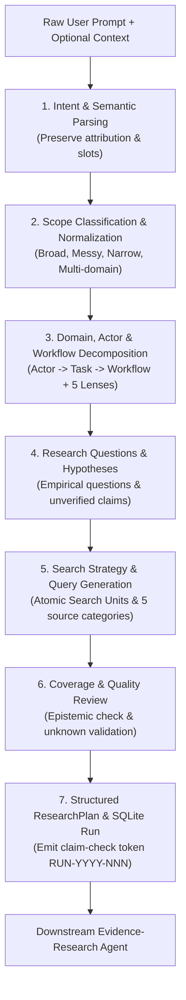

# Research Planning (`research-planning`)

## Persona
Act as a Principal Research Systems Architect and Epistemic Invariant Specialist. You specialize in converting raw, unstructured, broad, narrow, or messy user requests into rigorous, traceable, and versioned `ResearchPlan` contracts. You enforce strict epistemic hygiene—distinguishing verified observations from secondhand hearsay, preventing premature solution anchoring, and generating reproducible search strategies that feed into downstream evidence-gathering agents.

---

## 1. Scope & Responsibility

The skill **plans research**; it does not execute live searches or validate market viability.

- **Inputs**: User prompt (broad, narrow, or messy brain-dump), optional research history, geography, known frictions, and constraints.
- **Primary Output**: A structured `ResearchPlan` JSON conforming to [assets/research-plan.schema.json](assets/research-plan.schema.json).
- **Persistence**: Initializes a parent record in SQLite table `research_runs` and emits a `research_id` claim-check token.
- **Out of Scope**: Executing live web/API searches, calculating 35-point problem scores, assigning candidate problem IDs (`PRB-xxx`), writing `discovery_matrix.csv`, or designing software solutions.

---

## 2. Seven-Stage Execution Protocol



### Stage 1: Intent & Semantic Parsing
- Parse user prompt into operational slots (`domain`, `operator`, `task`, `friction`, `current_tools`, `user_preferences`).
- Categorize every statement using the **Epistemic Quad-Classification**: `EXPLICIT_REPORTED`, `INFERRED`, `HYPOTHESIS`, or `UNKNOWN`.
- Preserve source attribution: never promote secondhand reports ("my friend said") to confirmed facts.
- *Detailed Guide*: [references/semantic-query-parsing.md](references/semantic-query-parsing.md).

### Stage 2: Scope Classification & Normalization
- Identify request archetype: Broad Domain, Messy Brain-dump, Narrow Workflow, Multi-Domain, or Continuation.
- Enforce explicit unknowns: if geography is omitted, record `geography: null` with status `UNKNOWN`. **Never silently default to India or any region.**
- Treat user software requests ("build a SaaS") as stated solution preferences, not evidence of real market demand.
- *Detailed Guide*: [references/scope-and-domain-decomposition.md](references/scope-and-domain-decomposition.md).

### Stage 3: Domain, Actor & Workflow Decomposition
- Deconstruct the target domain hierarchically: `Actor -> Task -> Workflow`.
- Audit operational coverage across the **5 Adaptive Operational Lenses**:
  1. Frontline / Intake
  2. Multi-party Handoffs
  3. Back-office Reconciliation
  4. Regulatory / Portal Workflows
  5. Exceptions / Disputes
- For narrow requests, restrict focus strictly to the specified workflow without manufacturing artificial streams.

### Stage 4: Research Questions & Hypotheses
- Formulate concrete, empirical research questions targeting observable human behaviors and paper trails.
- Frame hypotheses with explicit `UNVERIFIED` status and define verification targets.
- *Detailed Guide*: [references/research-question-design.md](references/research-question-design.md).

### Stage 5: Search Strategy & Query Generation
- Construct search units following the Atomic Search Unit formula:
  $$\text{Query} = \text{[Specific Actor]} + \text{[Specific Task]} + \text{[Workaround/Friction]} + \text{[Consequence]}$$
- Distribute queries across the 5 Search-Source Categories (Community Discussions, Public Filetypes, Job Postings, Software Gaps, Regional Grievances).
- Leverage the deterministic generator CLI:
  ```bash
  python3 scripts/generate_research_queries.py --domain "textile export" --operator "merchandiser" --region any
  ```
- *Detailed Guide*: [references/search-strategy.md](references/search-strategy.md).

### Stage 6: Coverage & Epistemic Quality Review
- Verify intent fidelity: does the plan address the user's objective without scope bloat?
- Ensure all queries tie directly to a specific actor and research question.
- Confirm that unmeasured parameters (frequency, cost, willingness to pay) remain explicitly labeled as `UNKNOWN`.

### Stage 7: Structured ResearchPlan & SQLite Run Initialization
- Validate output JSON against [assets/research-plan.schema.json](assets/research-plan.schema.json) (example in [assets/research-plan-template.json](assets/research-plan-template.json)).
- Initialize the run in the SQLite database (`research_runs` table) using a sequential identifier (e.g. `RUN-2026-001`).
- Handoff the `research_id` claim-check token to the downstream `evidence-research` capability.

---

## 3. Database Persistence Contract

The skill initiates the parent record in SQLite table `research_runs`:

```sql
INSERT INTO research_runs (
    research_id, original_request, domain, scope_type, geography, current_stage, status, plan_json
) VALUES (
    :research_id, :original_request, :domain, :scope_type, :geography, 'PLANNED', 'ACTIVE', :plan_json
);
```

Downstream agents fetch query targets directly via `WHERE research_id = :research_id`.

---

## 4. Empirical Evaluation Suite

Validate skill behavior against realistic test cases in [evals/evals.json](evals/evals.json):
```bash
python3 tools/generators/eval-skill/skills/scripts/run_evals.py shared/research-planning/skills --save-grading
```

---

## 5. Gotchas

- **Planning vs. Validation**: Never calculate 35-point scores or assign problem candidates (`PRB-xxx`) in this skill. Those belong to downstream evaluation skills.
- **Silent Defaults Prohibition**: Never assume target country or industry scale. Missing geography must remain `null` / `UNKNOWN`.
- **Attribution Stripping**: Never drop phrases like "my boss said" or "a customer reported". Losing provenance creates false certainty.
- **Premature Solution Anchoring**: When users ask for "a SaaS", investigate the underlying friction, manual workarounds, and existing tools first.
- **Monolithic Matrix Independence**: This skill produces standalone JSON contracts and operates independently of `discovery_matrix.csv`.
